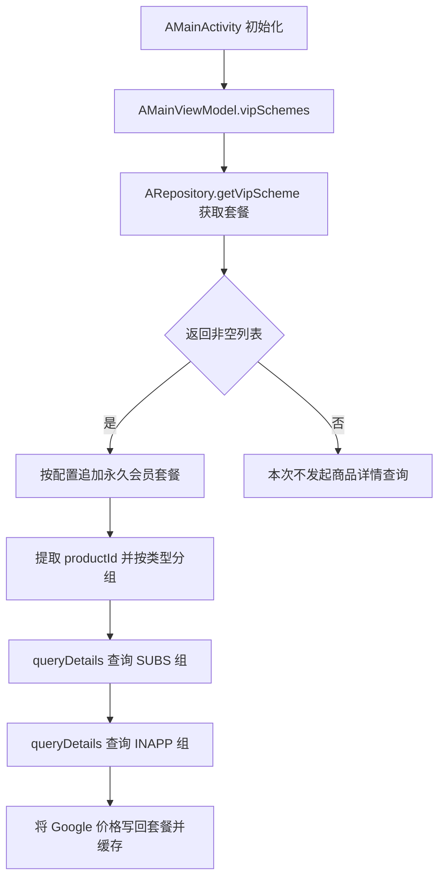
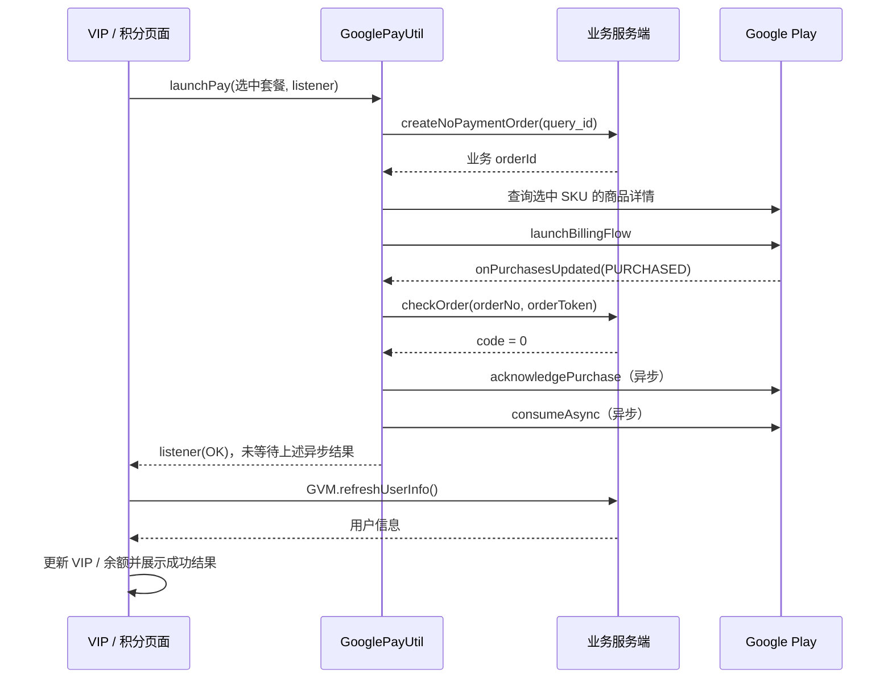

# Google Play 支付流程与商品查询说明

整理日期：2026-09-10。

本文基于当前项目实现，以 a 模块为主，补充公共 VIP、积分购买页面的调用方式。支付入口为 `module/face` 中的 `GooglePayUtil`，当前声明使用 Google Play Billing / billing-ktx 9.1.0。

## 1. 调用时机

| 时机 | 调用 | 实际作用 |
| --- | --- | --- |
| a 首页初始化，登录检查通过后 | `AMainActivity.init()` → `GooglePayUtil.init()` | BillingClient 未就绪且未连接中时，开始连接 Google Play |
| a 首页初始化 | `AMainActivity.init()` → `AMainViewModel.vipSchemes()` | 获取会员套餐，按商品类型批量查询 Google 价格并缓存 |
| a VIP 页面创建 | `AVipActivity.init()` → `AVipViewModel.refresh()` | 先使用已有套餐缓存展示，再请求套餐及 Google 商品信息，更新页面和缓存 |
| a VIP 页面回到前台 | `AVipActivity.onResume()` → `GooglePayUtil.init()` | 检查连接；此调用本身不会重新查询全部商品价格 |
| 公共积分购买页面创建 | `BuyPointActivity.init()` → `BuypointViewModel.getTFLOPConfigs()` | 获取积分套餐，再批量查询商品价格；有原价商品 ID 时额外查询原价 |
| 用户点击购买并通过页面检查 | `GooglePayUtil.launchPay(selectedBean, listener)` | 创建业务订单，再查询选中 SKU 并拉起 Google 支付 |
| Google 连接成功且补单标记开启 | `onBillingSetupFinished()` → `queryPurchase()` | 查询用户当前持有的购买记录并尝试补单 |
| 首页确认退出应用 | `onCloseApp()` → `GooglePayUtil.destroy()` | 关闭 BillingClient，随后退出应用进程 |

首页初始化中的 `GooglePayUtil.init()` 和 `mModel.vipSchemes()` 是两个独立调用。代码没有等待 Billing 连接成功回调后，再开始套餐和价格请求。

公共 `module/face` 的 `MainActivity` 初始化时还会同时触发会员套餐和积分套餐预取；a 模块的 `AMainActivity` 当前只显式调用会员套餐预取。公共 `VipActivity` 同样在页面初始化时刷新套餐，在 `onResume()` 检查 Billing 连接。

源码入口：

- [AMainActivity.kt:93](D:/ASWorkspace/YN/Alviora/Alviora/a/src/main/java/com/a/activity/AMainActivity.kt:93)
- [AVipActivity.kt:99](D:/ASWorkspace/YN/Alviora/Alviora/a/src/main/java/com/a/activity/AVipActivity.kt:99)
- [AVipActivity.kt:221](D:/ASWorkspace/YN/Alviora/Alviora/a/src/main/java/com/a/activity/AVipActivity.kt:221)
- [BuyPointActivity.kt:26](D:/ASWorkspace/YN/Alviora/Alviora/module/face/src/main/java/com/face/ui/BuyPointActivity.kt:26)

## 2. 何时查询“全部商品信息”

目前没有统一枚举 Google 后台所有商品的调用。批量查询范围由业务接口返回的套餐列表决定，调用方提取列表中的商品 ID，再交给 Google 查询。

### 2.1 a 首页预取



分组规则：

- `subscription == 0`：一次性商品，使用 `BillingClient.ProductType.INAPP`。
- 其他值：订阅，使用 `BillingClient.ProductType.SUBS`。
- 每组传入该类型的多个 `productId`；空组跳过。
- 代码先等待 SUBS 查询结果，再进行 INAPP 查询，两组按顺序执行。
- 当 `SPUtils.vipLifetime` 非空，且 `GVM.INSTANT.isShowTool.value != 0` 时，将永久会员配置解析为套餐并加入查询列表。
- 查询完成后更新价格、币种、试用期等数据，并写入 `SPUtils.vipSchemes`。

实现见 [AMainViewModel.kt:200](D:/ASWorkspace/YN/Alviora/Alviora/a/src/main/java/com/a/viewmodel/AMainViewModel.kt:200)。

### 2.2 进入 a VIP 页面

调用链为：

```text
AVipActivity.init()
  → mModel.refresh()
  → AVipViewModel.refreshSchemes()
  → ARepository.getVipScheme()
  → GooglePriceBean(套餐列表)
  → 按 SUBS / INAPP 分组调用 GooglePayUtil.queryDetails()
  → 更新 SPUtils.vipSchemes 和页面套餐列表
```

页面先从 `SPUtils.vipSchemes` 读取缓存，但缓存存在不会阻止本次刷新。首页已查询过，随后打开 VIP 页面仍会再次查询。

正常从其他页面返回现有 VIP 页面时，只执行 `onResume()` 的连接检查，不会仅因回到前台而重新执行 `refresh()`。页面重新创建时会重新走初始化流程。

实现见 [AVipViewModel.kt:27](D:/ASWorkspace/YN/Alviora/Alviora/a/src/main/java/com/a/viewmodel/AVipViewModel.kt:27)。

### 2.3 点击购买前的单商品查询

`launchPay()` 先创建业务订单。取得 orderId 后，`innerLaunchBilling()` 再查询选中套餐的一个 SKU，并用查询结果拉起支付。

该步骤直接调用 `billingClient.queryProductDetails()`，没有经过公共 `queryDetails()` 包装方法。订阅当前固定取返回商品的第一个 `subscriptionOfferDetails.offerToken`。

实现见 [GooglePayUtil.kt:166](D:/ASWorkspace/YN/Alviora/Alviora/module/face/src/main/java/com/face/util/GooglePayUtil.kt:166)。

## 3. 商品详情查询与购买记录查询

| 项目 | 商品详情查询 | 购买记录查询 |
| --- | --- | --- |
| 工具方法 | `queryDetails()`；购买前也直接调用 SDK 查询 | `queryPurchase()` |
| Google 接口 | `queryProductDetails()` | `queryPurchasesAsync()` |
| 输入 | 商品类型、指定商品 ID 列表 | 商品类型，分别查询 INAPP / SUBS |
| 返回内容 | 商品详情、价格、币种、订阅 offer 等 | 用户当前持有的购买记录、token、购买状态等 |
| 用途 | 展示套餐价格、构造支付参数 | 发现遗漏交易并补单 |
| 主要触发时机 | 首页预取、购买页加载、点击购买 | Billing 连接成功且补单标记开启 |

`GooglePayUtil.init()` 负责连接检查，不会主动查询商品目录。它的连接成功回调可能触发的是购买记录查询。

## 4. 完整支付流程



1. `launchPay()` 保存当前套餐，重置验单重试次数，记录购买点击事件并显示 Loading。
2. 使用套餐业务 ID 创建未付款订单，取得业务 orderId。
3. Billing 未就绪时设置连接后自动拉起标记；就绪后查询选中 SKU。
4. 拉起支付时，`obfuscatedProfileId` 保存业务 orderId；`obfuscatedAccountId` 使用用户 ID 或 `not_login`，并拼接是否存在试用文案的标记。
5. `onPurchasesUpdated()` 收到 `OK + PURCHASED` 后进入 `checkUpdate()`。当前仅处理未 acknowledged 的购买，且要求能够从 profileId 取到业务订单号。
6. 向服务端提交订单号和 purchaseToken 验单。请求框架以响应 `code == 0` 进入成功回调，工具不使用验单返回的 data 字符串。
7. 验单成功后，当前代码对所有购买异步调用确认和消耗，并立即通知页面成功、清空当前支付状态。该行为存在问题，详见第 7 节。
8. 页面关闭 Loading，并通过 `GVM.refreshUserInfo()` 更新用户信息。a VIP 页面刷新成功后打开成功页面；积分页面根据余额变化展示购买结果。刷新失败提示 `Auto refresh failed`。

支付工具不会直接写入 VIP 状态或余额。

## 5. 当前实际使用的业务接口

域名为 `https://www.vantasyx.com`。

| 动作 | 当前支付链路使用的路径 | 参数 |
| --- | --- | --- |
| 创建业务订单 | `POST /alviora?a=pay&m=createNoPaymentOrder` | 表单 `query_id = 套餐业务 ID` |
| 服务端验单 | `POST /alviora?a=pay&m=googlePayCallback` | 表单 `orderNo = 业务订单号`、`orderToken = purchaseToken` |
| 刷新用户权益 | `POST /alviora?a=login&m=getUserInfo` | 当前登录上下文 |

`GooglePayUtil` 和 `GVM.refreshUserInfo()` 仍使用 `com.face.net.Repository`。因此，虽然 a 模块套餐配置通过 ARepository 获取，支付下单、验单和支付后的用户刷新仍走公共模块的旧网关。

AApi 已有 `/pay/createNoPaymentOrder`、`/pay/googlePayCallback` 等直接路径，但当前共享支付工具没有调用它们。这里仅说明实际路由，未验证服务端旧网关是否仍有效。

`orderNo` 传递的是创建业务订单返回、随后放入 profileId 的订单号，不是 Google 的 GPA 订单号。

接口定义见 [Api.kt:888](D:/ASWorkspace/YN/Alviora/Alviora/module/face/src/main/java/com/face/net/Api.kt:888)；权益刷新见 [GVM.kt:220](D:/ASWorkspace/YN/Alviora/Alviora/module/face/src/main/java/com/face/util/GVM.kt:220)。

## 6. 补单和异常处理

### 6.1 补单时机

`autoQueryPurchaseAfterConnect` 初始为 true。连接成功后，`queryPurchase()` 分别查询 INAPP、SUBS 的当前持有记录，并逐笔调用 `checkUpdate()`。

任一类型查询成功，都会将该标记改为 false。此后同一进程内没有将它恢复为 true 的代码，后续连接成功也不会再自动查询；`init()` 在已连接时同样不会触发补单。

这不是全部历史交易查询。已 acknowledged 的购买直接跳过；没有 profileId 的购买也直接跳过。补单成功且没有当前支付 listener 时，不会主动刷新 GVM 用户信息。

实现见 [GooglePayUtil.kt:303](D:/ASWorkspace/YN/Alviora/Alviora/module/face/src/main/java/com/face/util/GooglePayUtil.kt:303)。

### 6.2 状态处理

| 状态或异常 | 当前行为 |
| --- | --- |
| 创建订单失败或返回空订单 | 调用 `payFail`，通知页面、清空当前状态并关闭 Loading |
| 连接失败或查不到商品 | 调用 `payFail`，部分分支使用通用提示和默认错误码 -1 |
| 用户取消 | 上报 cancel，通知 USER_CANCELED，清空状态并关闭 Loading |
| 实时购买回调返回 PENDING | 不进入验单，也没有等待付款提示或 Loading 收尾 |
| 购买记录查询返回 PENDING | 未过滤状态，仍会进入 `checkUpdate()` 的其他条件判断 |
| 验单失败 | 最多额外重试两次；当前判断的是错误码是否非空，不是网络异常类型 |
| 验单时没有可用页面 | 返回验单失败；验单请求目前依附 Activity 的生命周期作用域 |
| Google 确认或消耗失败 | 没有重试收尾；确认结果仅记录日志，消耗结果的错误码被忽略 |

## 7. 已识别问题与后续处理方向

以下为现有实现的静态分析结果，尚未修改：

1. **确认与消耗未区分商品类型。** 订阅也调用 consume；可消耗商品若确认成功但消耗失败，后续又会被 `isAcknowledged` 条件跳过，缺少补消耗路径。应区分可消耗商品、非消耗商品和订阅，并处理完成结果。Google 的消耗操作本身满足确认要求，订阅应使用确认操作，参见 [BillingClient 官方说明](https://developer.android.com/reference/com/android/billingclient/api/BillingClient)。
2. **补单与当前支付共用全局状态。** 旧单处理结果可能调用新单的 listener，并清空新单状态。应按订单号/token 隔离处理，补单独立触发权益刷新。
3. **PENDING 状态处理不完整。** 实时回调缺少等待付款提示，查询回调缺少状态过滤。应统一按购买状态分支，参见 [Google pending 处理说明](https://developer.android.com/google/play/billing/integrate#pending)。
4. **补单查询缺少后续恢复。** 任一类型查询成功就关闭自动查询；回前台、网络恢复和页面退出后的待处理订单缺少完整恢复路径。
5. **验单重试条件有误。** `onFailed` 的第二个参数是 errorCode，当前被当作网络异常判断条件；业务拒绝也会重试，且次数由所有订单共享。
6. **部分错误码未向页面传递。** `launchBillingFlow` 同步失败时使用默认 -1，可能无法进入页面已有的 ITEM_ALREADY_OWNED 专门处理分支。

具体位置、触发条件和建议见 [代码审查.md 中的支付审查](D:/ASWorkspace/YN/Alviora/Alviora/docs/代码审查.md:58)。

## 8. 验证范围

本文依据当前客户端源码及调用关系整理，未执行实际下单、Google 支付或服务端验单。服务端发货、幂等、订单归属校验、订阅续费和退款通知处理，需要结合服务端实现确认。

本次仅新增说明文档，未修改支付逻辑。
