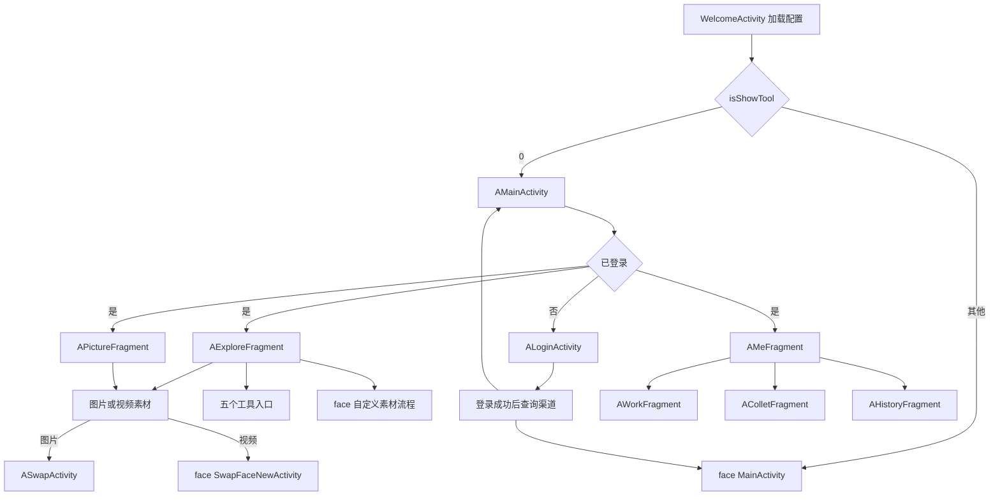
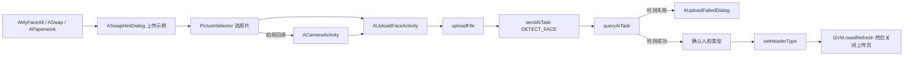
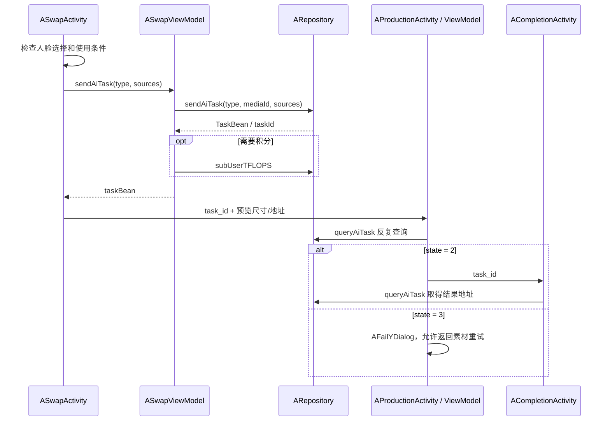
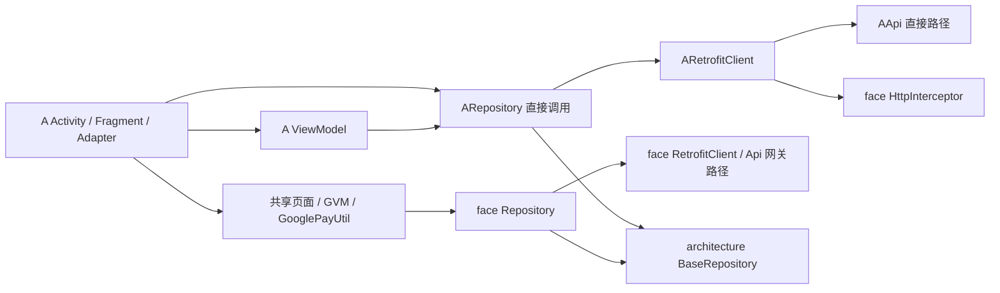

# a 模块功能与调用流程

整理日期：2026-09-10。根据当前工作区源码整理，包含尚未提交的改动；未执行接口请求或运行时页面遍历。

范围：[a/src/main/java/com/a](D:/ASWorkspace/YN/Alviora/Alviora/a/src/main/java/com/a)。模块内共 124 个 Kotlin 文件：34 个 Activity、6 个 Fragment、37 个 ViewModel、24 个 Adapter、18 个弹窗、3 个网络层文件、2 个视图辅助类。

[项目总览](D:/ASWorkspace/YN/Alviora/Alviora/docs/项目架构与模块调用流程.md) 说明 Gradle 模块和共享能力；[a 页面索引](D:/ASWorkspace/YN/Alviora/Alviora/docs/a模块页面索引.md) 逐一列出全部 40 个页面的职责、布局、绑定 ViewModel 和源码内的页面跳转。

## 1. 模块定位与入口

`a` 是一套独立的业务界面，使用自己的布局、Activity、ViewModel、Adapter、弹窗和 `ARepository`，同时依赖 `module:face` 中的基础页面、实体、登录/支付/广告工具、全局状态及部分完整业务页面。

启动入口位于 `module:main`。`WelcomeActivity` 完成配置加载后，`GVM.isShowTool == 0` 时进入 `AMainActivity`；其他已加载状态进入 `face/ui/MainActivity`。`AMainActivity` 检查登录状态，未登录先打开 `ALoginActivity`。运行中 `aIsAB == 1` 也会触发从 A 首页切换到共享首页。

定位：[AMainActivity](D:/ASWorkspace/YN/Alviora/Alviora/a/src/main/java/com/a/activity/AMainActivity.kt)、[WelcomeActivity](D:/ASWorkspace/YN/Alviora/Alviora/module/main/src/main/java/com/face/main/WelcomeActivity.kt)。图中的登录分支是概览，登录成功后会重新请求渠道状态，不能假定必然留在 a。

## 2. 首页、素材、搜索

| 功能 | 页面 / 关键类 | 数据与调用流程 |
| --- | --- | --- |
| Explore | `AExploreFragment`、`AExploreViewModel`、`AExploreListAdapter` | 加载 Banner、首页标签内容及分页推荐；列表内包含工具入口、栏目和素材卡片。 |
| Picture | `APictureFragment`、`APictureViewModel`、`APictureAdapter` | 类型选择后 `getMediaByTag(..., "image", selectedName2)` 刷新分页；首项 1:1，其他项根据素材尺寸或图片加载结果计算比例。 |
| 更多 | `AMoreActivity`、`AMoreViewModel`、`AFacePageAdapter` | `type == "Banner"` 请求 `getBannerDetails()`；`type == "Type"` 按 `title` 请求 `getMediaByTag()`。 |
| 搜索 | `ASearchActivity`、`ASearchViewModel` | `searchAi("image", keywords)` 获取分页结果；共享 Room `AppDatabase.searchHistoryDao()` 保存/读取搜索历史。 |
| 自定义素材 | `ACustomDialog`、`AMainToolDialog` | 选择 image/video；根据 `toolPicHint`、`toolVideoHint` 展示提示，再跳转 **face 的** `CustomStartActivity`。 |

素材点击通常在 Adapter 中处理：`AExploreBannerAdapter`、`AExploreLikeAdapter`、`AExploreListAdapter`、`AFacePageAdapter`、`APictureAdapter`、`ACollectAdapter`、`AFaceBrowsingAdapter`、`AMeCollectAdapter`、`AMeHistoryAdapter` 会按 `mediaType` 分流，图片进入 `ASwapActivity`，视频进入共享 `SwapFaceNewActivity`。

定位：[AExploreListAdapter](D:/ASWorkspace/YN/Alviora/Alviora/a/src/main/java/com/a/adapter/AExploreListAdapter.kt)、[APictureAdapter](D:/ASWorkspace/YN/Alviora/Alviora/a/src/main/java/com/a/adapter/APictureAdapter.kt)、[ASearchViewModel](D:/ASWorkspace/YN/Alviora/Alviora/a/src/main/java/com/a/viewmodel/ASearchViewModel.kt)、[AMoreActivity](D:/ASWorkspace/YN/Alviora/Alviora/a/src/main/java/com/a/activity/AMoreActivity.kt)。更多页调用方传入的 `openValue` 当前没有在该 Activity 中读取，不作为已生效的筛选条件。

## 3. 个人中心与各类历史

`AMeFragment` 观察 `GVM.userInfo` 展示头像、账号绑定与 VIP 状态；余额绑定 `userInfo.tflops`，点击余额进入共享 `SigninActivity`。游客账号点击绑定入口显示 `ALoginDialog`，调用 `bindGuestUser` 绑定 Google 账号。非游客点击账号区域进入 VIP 页面。

VIP 用户显示会员标识和到期时间；过期账号显示过期提示；非 VIP 显示升级区域。升级价格取 `SPUtils.vipSchemes` 的第一个方案，与 VIP 页默认选择一致。

| 位置 | 含义 | 数据来源 | 点击结果 |
| --- | --- | --- | --- |
| Me → Works | 已提交的换脸作品及任务 | `AWorkViewModel` → `ARepository.getUserMedia("All")` | 完成 → `ACompletionActivity`；生成中 → 进度页；失败 → `AFailYDialog` 后重试。 |
| Me → Saved | 收藏的素材 | `AColletViewModel` → `ARepository.getUserCollect()`，筛选 type 为 media | 图片 → A 换脸；视频 → face 换脸。 |
| Me → History | 浏览过的素材 | `AHistoryViewModel` → `ARepository.getUserViewHistory()` | 图片 → A 换脸；视频 → face 换脸。 |
| `AGenerateActivity` | 独立的生成历史页 | `AGenerateViewModel` → `ARepository.getUserMedia("All")` | 结果/进度/失败重试及删除。 |
| `ACollectActivity` | 独立收藏页 | `ACollectViewModel` → `ARepository.getUserCollect()` | 素材预览与换脸。 |
| `ABrowsingActivity` | 独立浏览历史页 | `ABrowsingViewModel` → `ARepository.getUserViewHistory()` | 素材预览与换脸。 |
| `AToolHistoryActivity` | 工具已保存的生成记录 | `getUserRecordPage(aiType)` | 重命名及部分类型的结果查看。 |
| `AToolTaskHistoryActivity` | 工具生成记录和任务合并列表 | `getUserRecordPage(aiType)` + `getUserAiTask(aiType)` | 完成查看、生成中继续等待、失败处理、删除/重命名。 |

Works 对 `taskBean.media.title == "owner"` 有专门分支：生成中进入共享 `ProductionActivity`，失败重试进入共享 `SwapFaceNewActivity`；完成仍进入 `ACompletionActivity`。普通素材生成中进入 `AProductionActivity`，失败重试再按图片/视频分流。不能将所有 Works 项统一理解为只经过 A 页面。

Me 在 `onResume()` 调用 `refresh()`，刷新用户并设置 `GVM.aIsMeRefresh`；三个子页观察该标记重新加载列表。空列表的制作入口通过 `GVM.aSelectIndex = 0` 让首页切回 Explore。

`AMeFragment` 中保留了打开独立收藏/生成/浏览页的方法；当前主布局装配的是三个 Tab。方法存在不代表当前界面一定有对应按钮。

定位：[AMeFragment](D:/ASWorkspace/YN/Alviora/Alviora/a/src/main/java/com/a/fragment/AMeFragment.kt)、[fragment_amine.xml](D:/ASWorkspace/YN/Alviora/Alviora/a/src/main/res/layout/fragment_amine.xml)、[AWorkFragment](D:/ASWorkspace/YN/Alviora/Alviora/a/src/main/java/com/a/fragment/AWorkFragment.kt)、[AToolTaskHistoryViewModel](D:/ASWorkspace/YN/Alviora/Alviora/a/src/main/java/com/a/viewmodel/AToolTaskHistoryViewModel.kt)。

## 4. 人脸库与上传

入口有 `ASettingActivity.onFaceAll()`、`AMeFragment.onFaceAll()`、换脸页和证件照页的新增按钮。当前设置页可直接进入 `AMyFaceAllActivity`，该页面展示人脸库、添加入口和删除模式；删除通过 `ARemoveFaceDialog` 确认后调用 `deleteUserPic`。

上传示例受 `SPUtils.openFace` 控制，已展示过时可以直接进入选图。上传入口传 `img_url`，通常为选择器返回的 `sandboxPath` 或 `availablePath`，拍照则传本地文件路径。`AUploadViewModel` 负责上传、任务查询和状态；检测成功后由页面调用 `setHeaderType`，完成时同时设置 `SPUtils.isMaterial = true`。页面本地 `uploadSate` 的含义与后端任务 `state` 不相同，不能混用。

定位：[AUploadFaceActivity](D:/ASWorkspace/YN/Alviora/Alviora/a/src/main/java/com/a/activity/AUploadFaceActivity.kt)、[AUploadViewModel](D:/ASWorkspace/YN/Alviora/Alviora/a/src/main/java/com/a/viewmodel/AUploadViewModel.kt)、[AMyAllFaceViewModel](D:/ASWorkspace/YN/Alviora/Alviora/a/src/main/java/com/a/viewmodel/AMyAllFaceViewModel.kt)。

## 5. 换脸 → 生成 → 结果

### 5.1 选择人脸及按钮状态

`ASwapActivity` 先请求 `getMediaByID(media_id)`，获取素材、收藏 ID、目标人脸列表；页面恢复时加载用户人脸。`ASwapViewModel` 管理目标人脸与用户人脸的对应关系：

| 状态 | 实际界面和规则 |
| --- | --- |
| 单人脸素材 | `conList` 隐藏；`conOperation` 默认显示；人脸选项不加入“禁用”项。 |
| 多人脸素材 | 默认显示 `conList/rlTab`，`conOperation` 在 `isShow == true` 时显示；点目标人脸后选择对应用户人脸。 |
| 多人脸“禁用”项 | 清除当前目标人脸的分配；不会清空其他目标人脸。 |
| 可生成 | `sources` 在至少一个目标被分配有效图片时为 true；`tvComplete2.enabled` 直接绑定该状态。 |
| 无有效选择 | `tvComplete2` 不可用；生成函数本身也会检查是否有分配。 |
| 删除了已选人脸 | 刷新人脸库时重新匹配分配，失效的选择会清除并重新计算按钮状态。 |

定位：[ASwapViewModel](D:/ASWorkspace/YN/Alviora/Alviora/a/src/main/java/com/a/viewmodel/ASwapViewModel.kt:49)、[activity_aswap.xml](D:/ASWorkspace/YN/Alviora/Alviora/a/src/main/res/layout/activity_aswap.xml:49)。

### 5.2 提交与等待

生成参数 `sources` 按目标人脸顺序，用逗号连接用户图片 URL；未分配的位置保留空段。提交前检查长视频积分、普通用户免费次数/广告次数，以及 VIP 使用次数后的广告规则。相关值来自 `SPUtils` 与 `GVM.userInfo`，不同工具的权益分支并不完全相同。

`ASwapActivity` 内部支持图片 `FACESWAP`、视频 `VIDEO_FACESWAP`、长视频 `LONG_VIDEOSWAP` 分支；但当前常用列表的视频入口通常走共享换脸页。进度百分比根据创建时间/预计完成时间估算，是否完成以接口任务状态为准。

收藏通过 `saveCollect` / `removeUserCollect`；素材举报通过 `AReportDialog` → `ASwapViewModel.getReport()` → `mediaBlack`。

### 5.3 结果操作

`ACompletionActivity` 根据任务结果显示带水印图或视频，下载使用 `result.mData` 中的原始结果。VIP 可下载，非 VIP 跳转 `AVipActivity`；下载由共享 `DownloadUtil` 完成，再通过 `FileUtil` 保存到公共目录。删除调用 `deleteUserMedia(taskId)`。

**当前源码的结果举报行为与素材举报不同**：`ACompletionActivity.onReport()` 和 `AToolCompletionActivity.onReport()` 都显示 `AReportDialog`，但确认回调实际调用 `deleteTask()`，没有使用理由/屏蔽值调用 `mediaBlack`。这里记录实际行为，本文没有修改业务。

定位：[ASwapActivity](D:/ASWorkspace/YN/Alviora/Alviora/a/src/main/java/com/a/activity/ASwapActivity.kt:187)、[AProductionActivity](D:/ASWorkspace/YN/Alviora/Alviora/a/src/main/java/com/a/activity/AProductionActivity.kt)、[ACompletionActivity](D:/ASWorkspace/YN/Alviora/Alviora/a/src/main/java/com/a/activity/ACompletionActivity.kt:180)、[AToolCompletionActivity](D:/ASWorkspace/YN/Alviora/Alviora/a/src/main/java/com/a/activity/AToolCompletionActivity.kt)。

## 6. 五个工具

首页的五个点击入口位于 `AExploreListAdapter`，不是单独的 Tools Fragment。

| 功能 | 页面链 | 请求参数与任务类型 | 结果 / 历史 |
| --- | --- | --- | --- |
| 画笔消除 | `AClearStartActivity` → `AClearAiActivity` | 画布产生蒙版，先上传原图再上传蒙版；`sources = 原图URL,蒙版URL`，类型 `LAMA_CLEANER`。 | 编辑页内查询并显示结果，可继续消除/前后对比；点击保存调用 `saveUserGenerateRecords`，成功后进入 `AToolCompletionActivity`。历史入口为 `AToolHistoryActivity`。 |
| 证件照 | `APaperworkStartActivity` → `APaperworkActivity` → `AToolGeneratingActivity` | 选择已有/新增人脸、服装、背景色、尺寸；`sources = 图片URL\|服装\|背景色\|尺寸`，类型 `ID_CARD`。 | `AToolCompletionActivity`；`AToolTaskHistoryActivity` 默认类型就是 `ID_CARD`。开始前检查已有任务。 |
| 卡通化 | `ACartoonStartActivity` → `ACartoonActivity` | `getStyle("common_style")` 加载风格，再上传图片和提交 `IMG2CARTOON`。 | 编辑页内查询，成功进入 `AToolCompletionActivity`；历史 `AToolHistoryActivity`。 |
| 背景移除 | `ARemovalStartActivity` → `ARemovalActivity` | 上传照片，提交 `RMBG`。 | 编辑页内查询，结果页传 `ist = true` 显示透明背景；历史 `AToolHistoryActivity`。 |
| 年龄变化 | `AChangeStartActivity` → `AChangeActivity` → `AToolGeneratingActivity` | 选择年龄、上传照片，提交 `CHANGE_AGE`；开始前检查已有任务。 | `AToolCompletionActivity`；`AToolTaskHistoryActivity(aiTaskType = CHANGE_AGE)`。 |

`AClear` 表示画笔消除，`ARemoval` 表示背景移除；它们不是同一个功能。证件照和年龄变化使用统一进度页；卡通化、抠图和消除在自己的页面查询任务。

证件照开始页当前的 VIP 拦截已注释，`onstart()` 直接检查任务并决定是否进入配置页。不要把其他工具的入口限制套用到该页面。

### 6.1 统一工具进度

`AToolGeneratingActivity` 接收 `taskId`，ViewModel 每次查询完成后延迟约 2 秒；状态 0、1 或尚无有效任务结果时继续查询。页面的秒级计时器只更新预计等待时长/百分比。

- 状态 2：构造 `ToolTaskBean`，`id = params.recordid`，`recordUrl = 原始结果URL,带水印结果URL`，进入工具结果页。
- 状态 3：停下界面计时，显示任务错误。重试按 taskType 跳回 A 证件照、A 年龄变化，或共享 `LiveStartActivity`；不是任意任务类型都配置了重试目标。
- 终止：确认后调用 `cancelTask(taskId)` 并关闭页面。

定位：[AToolGeneratingViewModel](D:/ASWorkspace/YN/Alviora/Alviora/a/src/main/java/com/a/viewmodel/AToolGeneratingViewModel.kt)、[AToolGeneratingActivity](D:/ASWorkspace/YN/Alviora/Alviora/a/src/main/java/com/a/activity/AToolGeneratingActivity.kt)。

### 6.2 工具结果与记录

工具结果页接收整个 `ToolTaskBean`，从 `recordUrl` 第一段取得下载地址、最后一段取得显示地址；下载要求 VIP，删除调用 `deleteUserRecord(recordId)`。换脸结果页则通过 `task_id` 再查询，并使用 `deleteUserMedia(taskId)`。**任务 ID 和生成记录 ID 不能混用。**

`AToolTaskHistoryViewModel` 并发查询任务及记录，将两者转成 `ToolTaskBean` 列表。失败任务删除走 `deleteUserMedia(taskId)`，完成记录删除走 `deleteUserRecord(id)`，重命名走 `updataUserGenerateRecords`。

当前 `AToolHistoryAdapter` 的结果点击绑定处列举 `RMBG/IMG2CARTOON/OLD_PHONE/ID_CARD/CHANGE_AGE/DYNAMIC`，没有列入 `LAMA_CLEANER`；虽有消除历史入口，不能据此断言其记录点击已和其他类型一致。此处保留源码现状说明。

定位：[AClearAiActivity](D:/ASWorkspace/YN/Alviora/Alviora/a/src/main/java/com/a/activity/tool/AClearAiActivity.kt)、[AToolPaperworkViewModel](D:/ASWorkspace/YN/Alviora/Alviora/a/src/main/java/com/a/viewmodel/AToolPaperworkViewModel.kt)、[AToolHistoryAdapter](D:/ASWorkspace/YN/Alviora/Alviora/a/src/main/java/com/a/adapter/AToolHistoryAdapter.kt)。

## 7. 登录、设置、VIP

| 功能 | 实际流程 |
| --- | --- |
| Google 登录 | `ALoginActivity` → 隐私确认 → 共享 `GoogleLoginUtil` → `ARepository.googleLogin` → `GVM.updateUserInfo` → 查询渠道 → A/face 首页。 |
| 游客登录 | `ALoginActivity.onSpik()` → `googleLogin("guest", deviceId, "")` → 相同的用户更新/渠道分流。 |
| 账号登录/注册 | `ALoginAccountActivity` / `ACreateAccountActivity` 直接调用 ARepository 的账号接口；成功后也重新查询渠道。 |
| 游客绑定 | `AMeFragment` → `ALoginDialog` → Google 凭据 → `bindGuestUser` → 更新 GVM 用户。 |
| 修改密码 | 设置页仅 `loginType == "app"` 时展示入口 → `AUpdateAccountActivity` → `updatePassword`。 |
| 切换语言 | `ALanguagePopup` 从 `a_settings_language_codes/names` 数组配对生成选项 → 保存 `SPbaseUtils.spLanguage/spCacheLanguage` → `AppCompatDelegate.setApplicationLocales`。 |
| 退出登录 | `ALogoutDialog` 确认 → `GoogleLoginUtil.signOut` → `GVM.updateUserInfo(UserBean(), 4)` → `ALoginActivity`。 |
| 注销账号 | `ADeleteUserActivity` 倒计时/确认步骤 → `deleteUserInfo` → 清理登录状态；页面提供系统订阅管理入口。 |
| VIP 购买 | `AVipViewModel.getVipScheme` → `GooglePayUtil` 查商品价格 → 页面选择方案 → `launchPay` → 支付回调 → GVM 刷新用户 → `AVipSuccessActivity`。 |

`AMainActivity` 进入时也会初始化 Billing、预取方案价格并保存订阅相关设置。`AVipActivity` 支付走 **face 的共享 GooglePayUtil**，其创建订单/校验订单仍使用 face `Repository`，不会因入口在 a 就自动切换成 ARepository。完整时序见 [Google Play 支付流程](D:/ASWorkspace/YN/Alviora/Alviora/docs/GooglePlay支付流程.md)。

定位：[ASettingActivity](D:/ASWorkspace/YN/Alviora/Alviora/a/src/main/java/com/a/activity/ASettingActivity.kt)、[ALanguagePopup](D:/ASWorkspace/YN/Alviora/Alviora/a/src/main/java/com/a/view/ALanguagePopup.kt)、[ALoginDialog](D:/ASWorkspace/YN/Alviora/Alviora/a/src/main/java/com/a/dialog/ALoginDialog.kt)、[AVipActivity](D:/ASWorkspace/YN/Alviora/Alviora/a/src/main/java/com/a/activity/AVipActivity.kt)。

## 8. 网络层与共享能力边界

| 文件 / 组件 | 作用 |
| --- | --- |
| [AApi.kt](D:/ASWorkspace/YN/Alviora/Alviora/a/src/main/java/com/a/net/AApi.kt) | Retrofit 接口声明；地址、模块前缀、HTTP 方法、参数编码与响应类型。接口范围大于当前 A 页面实际用到的功能。 |
| [ARetrofitClient.kt](D:/ASWorkspace/YN/Alviora/Alviora/a/src/main/java/com/a/net/ARetrofitClient.kt) | 普通请求与上传 Service，基地址都取 AApi；复用 face HttpInterceptor，维护内存 CookieJar。 |
| [ARepository.kt](D:/ASWorkspace/YN/Alviora/Alviora/a/src/main/java/com/a/net/ARepository.kt) | 请求封装、业务参数加工、分页；继承 BaseRepository；登录过期错误通过 GVM 更新用户状态。 |
| `GVM`、`SPUtils`、`SPbaseUtils` | 共享运行状态、账号/VIP、配置、语言、刷新通知；不是 A 专属的第二份用户数据。 |
| `com.face.bean` | A 页面仍使用共享素材、人脸、任务、用户、VIP 等实体。 |
| `BaseBindingActivity/Fragment`、`BaseViewModel` | 页面绑定、生命周期、请求协程、Loading/Error 等公共能力。 |

当前 `a/src/main/java` 中直接使用的 Repository 已切换为 ARepository；但 Welcome 的 `InitViewModel`、GVM 用户刷新、GooglePayUtil、共享签到/反馈/视频换脸/自定义素材页仍经过 face 的 Repository。AApi 和旧 Api 是两套并存的请求路径，不是 Retrofit 自动按 A/B 切换。

## 9. Adapter、弹窗和视图辅助类

下面覆盖除页面/ViewModel/网络层以外的 44 个文件。页面绑定的 ViewModel 见页面索引；37 个 A ViewModel 中既有请求逻辑类，也有只保存表单/选择状态的类。

| 分组 | 类 | 职责 |
| --- | --- | --- |
| Explore（3） | `AExploreListAdapter`、`AExploreBannerAdapter`、`AExploreLikeAdapter` | 首页复合列表、Banner、推荐素材；包含更多、工具、换脸跳转。 |
| 素材/分类（3） | `APictureAdapter`、`AFacePageAdapter`、`ATypeAdapter` | 图片比例/分页列表、公共分页卡片、分类选中。 |
| 独立收藏/历史（3） | `ACollectAdapter`、`AFaceBrowsingAdapter`、`AHistoryAdapter` | 收藏、浏览、生成历史展示；生成历史页面设置点击/删除回调。 |
| Me 三页（3） | `AMeWorkAdapter`、`AMeCollectAdapter`、`AMeHistoryAdapter` | Works、Saved、History 网格。 |
| 人脸（4） | `ASwapAdapter`、`ASwapTabAdapter`、`AUserAdapter`、`AMyAllFaceAdapter` | 用户人脸候选、目标人脸分配、证件照人脸选择、人脸库管理。 |
| 工具选项（3） | `ACartoonAdapter`、`AColorAdapter`、`ASizeAdapter` | 卡通风格、背景色、证件照尺寸。 |
| 工具记录（2） | `AToolHistoryAdapter`、`ATaskHistoryAdapter` | 已保存记录与含进行中任务的记录展示、点击路由。 |
| 其他列表（3） | `AVipSchemeAdapter`、`ASearchHistoryAdapter`、`AReportAdapter` | VIP 方案、搜索历史、举报理由。 |
| 通用提示（5） | `BaseYDialog`、`BaseAHintDialog`、`ABaseHintDialog`、`ABaseContentDialog`、`AFailYDialog` | 参数化提示/确认及生成失败提示；两个 Hint 类名称接近但分别存在。 |
| 账号/退出（3） | `ALoginDialog`、`ALogoutDialog`、`AExitDialog` | Google 绑定、退出登录确认、关闭应用确认。 |
| 人脸（3） | `ASwapHintDialog`、`AUploadFailedDialog`、`ARemoveFaceDialog` | 上传示例、检测失败、人脸删除确认。 |
| 广告/权益（3） | `AAdsShowDialog`、`AAdsVipShowDialog`、`AExperienceDialog` | 看广告/跳过回调、VIP 高频使用提示、升级入口。 |
| 内容及入口（4） | `AReportDialog`、`ACustomDialog`、`AMainToolDialog`、`ANoticeDialog` | 举报选项、自定义照片/视频选择、使用提示、公告确认。 |
| 视图辅助（2） | `AMeGridItemDecoration`、`ALanguagePopup` | Me 网格间距与语言菜单。 |

源码目录：[adapter](D:/ASWorkspace/YN/Alviora/Alviora/a/src/main/java/com/a/adapter)、[dialog](D:/ASWorkspace/YN/Alviora/Alviora/a/src/main/java/com/a/dialog)、[viewmodel](D:/ASWorkspace/YN/Alviora/Alviora/a/src/main/java/com/a/viewmodel)、[view](D:/ASWorkspace/YN/Alviora/Alviora/a/src/main/java/com/a/view)。

## 10. 关键参数与刷新约定

| 目标 / 状态 | 参数或字段 | 说明 |
| --- | --- | --- |
| `ASwapActivity` | `media_id`、`type_custom` | jump 方法传入素材及自定义类型；实际素材读取主要依据 media_id。 |
| `AProductionActivity` | `task_id`、`urlImg`、`imgw`、`imgh` | 换脸任务和进度预览。 |
| `ACompletionActivity` | `task_id` | 进入后重新查询完整任务。 |
| `AUploadFaceActivity` / 图片工具输入页 | `img_url` | 本地输入图片路径。 |
| `AToolGeneratingActivity` | `taskId`、`title` | 与换脸链的 `task_id` 拼写不同；标题缺省为证件照生成。 |
| `AToolCompletionActivity` | `task`、`ist`、`title` | task 为 ToolTaskBean；ist 表示透明底；title 在当前类中读取。 |
| 工具历史 | `aiTaskType` | 普通历史默认 LAMA_CLEANER，任务历史默认 ID_CARD。 |
| `AVipSuccessActivity` | `jiage` | 价格文案。 |
| 人脸刷新 | `GVM.needRefresh`、`SPUtils.isMaterial` | 上传完成/页面恢复时协调重新加载。 |
| Me 刷新与首页选择 | `GVM.aIsMeRefresh`、`GVM.aSelectIndex` | 子页刷新及返回 Explore 的请求。 |

推送由 Welcome 传给 `AMainActivity.handleIntent`：100 查询任务（当前明确处理 FACESWAP → ACompletion、ID_CARD → AToolTaskHistory）；201 → 共享 Signin；301 → 共享 FeedbackMsg。虽读取 `media_id`，当前 A 首页没有 101 素材推送分支。共享 MainActivity 的分支范围更广，详见项目总览。

## 11. 阅读顺序

1. 总体导航：`AMainActivity` → 三个首页 Fragment → `AExploreListAdapter` / Me 子页。
2. 换脸主链：`ASwapActivity` + `ASwapViewModel` → `AProductionActivity` → `ACompletionActivity`。
3. 工具：从五个 StartActivity 进入对应编辑页，区分“编辑页内查询”与“统一生成页”。
4. 请求来源：先看当前调用的是 ARepository 还是共享工具/页面，再定位 AApi 或 face Api。
5. UI 定位：使用 [页面索引](D:/ASWorkspace/YN/Alviora/Alviora/docs/a模块页面索引.md) 查布局、ViewModel 和导航行号；流程中的状态仍以具体源码分支为准。
