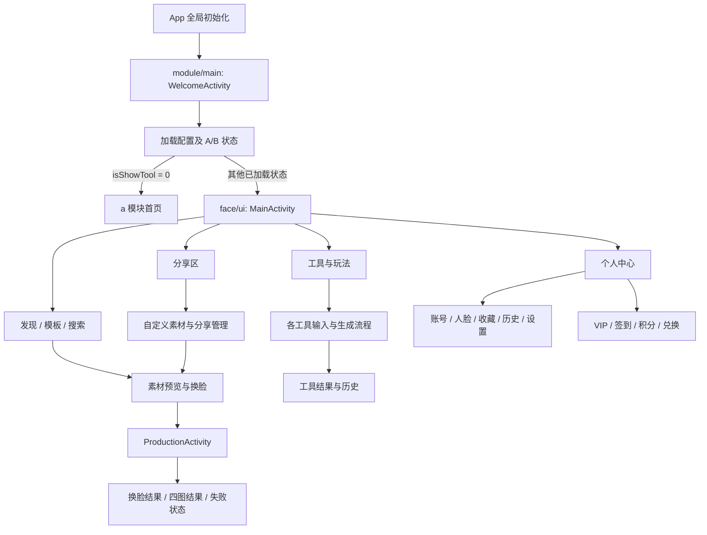
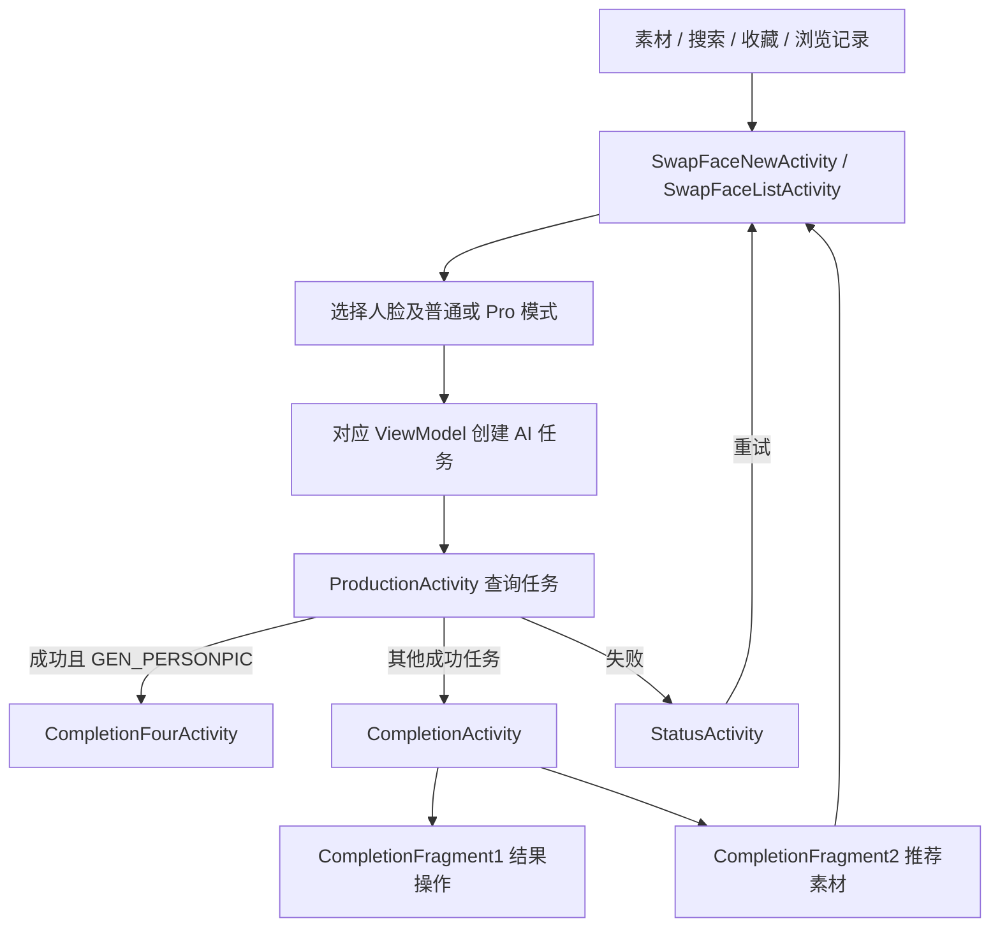
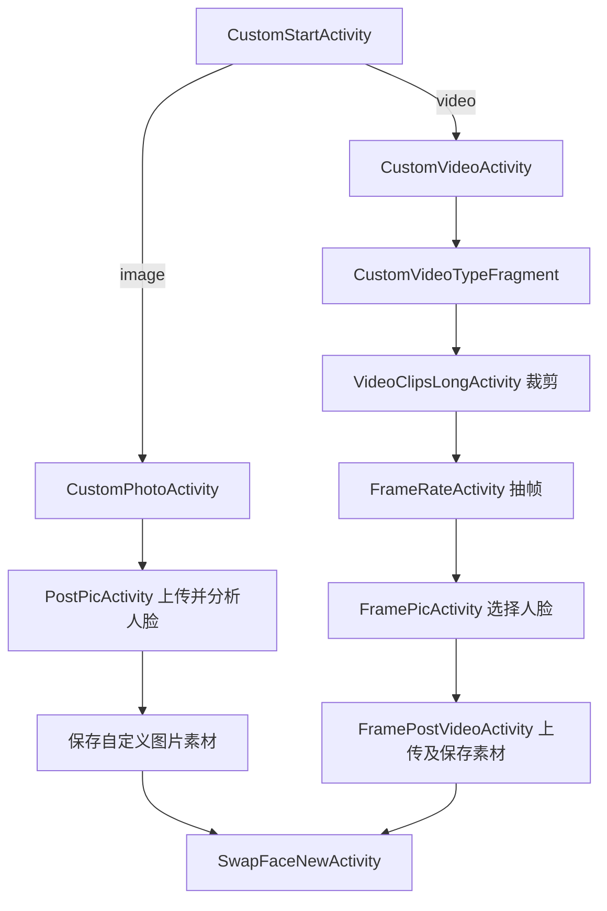
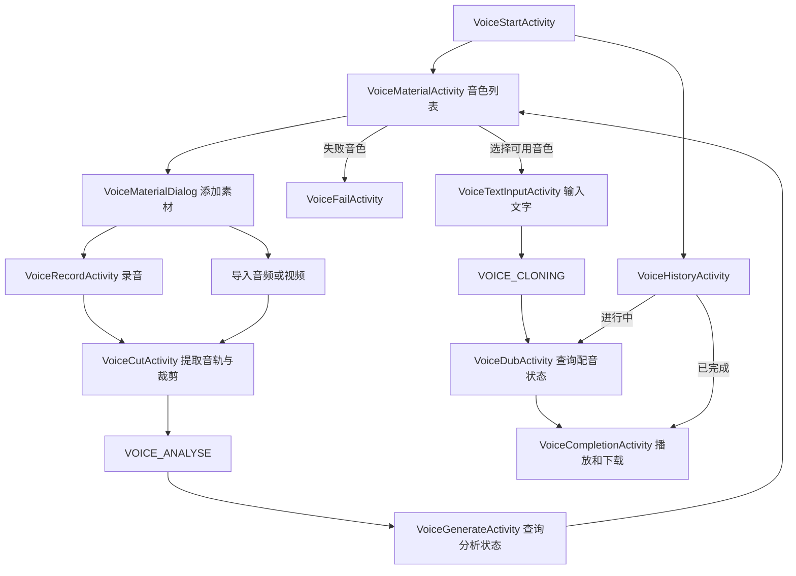

# face/ui 模块功能与调用流程

整理日期：2026-09-10。

范围：[module/face/src/main/java/com/face/ui](D:/ASWorkspace/YN/Alviora/Alviora/module/face/src/main/java/com/face/ui)，共 116 个 Kotlin 文件。这里的“模块”指功能分组和包目录；它们都属于同一个 Gradle 模块 `module:face`。

本文说明功能和主要调用链；[完整页面索引](D:/ASWorkspace/YN/Alviora/Alviora/docs/face-ui页面索引.md) 逐一列出 116 个文件的职责、绑定的 ViewModel 和源码内可识别的页面跳转。

## 1. 整体结构



Activity/Fragment 负责绑定视图、接收点击、观察状态及导航；对应 ViewModel 通常负责加载列表、上传文件、创建和查询任务，通过 `Repository` 调用接口。列表项跳转也可能直接写在 Adapter 中。`GVM` 共享登录、VIP、刷新标记等运行状态，`SPUtils` 保存配置和缓存。

`BaseBindingActivity`、`fragment/BaseBindingFragment` 提供公共视图绑定和 ViewModel 支持。若启动配置丢失，Activity 基类可能通过 `SPUtils.mainAct` 返回启动页，不能只根据当前 Activity 判断最终停留页面。

## 2. 首页、浏览与个人中心

### 2.1 首页的五个栏目

[MainActivity.getFragment](D:/ASWorkspace/YN/Alviora/Alviora/module/face/src/main/java/com/face/ui/MainActivity.kt:304) 按位置创建：

| 位置 | 页面 | 主要功能及下级页面 |
| --- | --- | --- |
| 0 | `ExploreFragment` | 发现栏目；`ExploreFragment1` 展示推荐、专题、热门和工具快捷入口；`ExploreFragment2` 按日期展示新素材，是否装配取决于配置 |
| 1 | `TemplateFragment` | 模板栏目，按类型装配 `VideoPictureFragment`，提供图片/视频素材浏览和筛选 |
| 2 | `ToolFragment` | 工具栏目；`ToolFragment1` 是基础图片/自定义/语音工具，`ToolFragment2` 是视频玩法和动态玩法 |
| 3 | `ShareZoneFragment` | 社区分享素材浏览、排序筛选及我的分享入口 |
| 4 | `MeFragment` | 用户信息、VIP、签到、人脸、收藏、历史、设置、反馈和邀请分享 |

导航栏实际可见性、默认位置与权限受配置和用户状态影响。`PictureFragment` 是另一个独立图片列表实现，当前上述主导航没有直接装配它。

### 2.2 素材浏览链

```text
发现 / 模板
  ├─ 专题、热门、分类入口 → DetailsActivity
  ├─ 搜索 → SearchActivity → SearchResultFragment
  └─ 点击素材列表项 → SwapFaceListActivity 或 SwapFaceNewActivity

个人中心
  ├─ 浏览记录 → BrowsingActivity → 点击素材 → SwapFaceNewActivity
  └─ 收藏 → CollectActivity → CollectResultFragment → 点击素材 → 换脸页
```

`DetailsActivity` 展示的是专题/分类素材列表：通过 `type` 区分 Banner、Hot、Type、Like 等，通过 `openValue` 指定专题。其素材项点击交由 Adapter 处理。

主要列表路由例子：`FacePageAdapter`、`FaceAdapter`、`CustomAdapter` 和分享素材 Adapter 可进入 `SwapFaceListActivity`；`FaceBrowsingAdapter` 进入 `SwapFaceNewActivity`。因此，在列表 Activity 中没有看到 `openActivity`，不代表列表项没有导航。

## 3. 换脸、人物风格和人脸管理

### 3.1 换脸主流程



- `SwapFaceNewActivity` 接收一个 `media_id`，适合单素材或自定义素材入口；内部通过 `SwapNewFragment` 展示普通/Pro 页面。
- `SwapFaceListActivity` 接收素材列表上下文，允许在列表中切换素材；内部使用 `SwapFragment`。
- 两者都负责素材预览、人脸选择、模式选择及生成入口，上传和创建任务由对应 ViewModel/公共工具承担。
- `ProductionActivity` 查询任务并显示进度，支持取消、返回首页、通知设置和 VIP 入口。公共路径成功后按 `taskType` 分到普通结果或个人风格四图结果，失败进入 `StatusActivity`。
- `CompletionActivity` 的第一个 Fragment 负责预览、下载、反馈和再次制作；第二个 Fragment 展示推荐素材，可继续进入换脸。

上图是公共 face 页面路径。A 模式下，`ProductionActivity` 成功会按 `SPUtils.aCompletionName` 跳到 a 模块完成页；失败使用提示弹窗收尾。

主要依据：[SwapFaceNewActivity.jump](D:/ASWorkspace/YN/Alviora/Alviora/module/face/src/main/java/com/face/ui/SwapFaceNewActivity.kt:101)、[ProductionActivity](D:/ASWorkspace/YN/Alviora/Alviora/module/face/src/main/java/com/face/ui/ProductionActivity.kt:104)。

### 3.2 人脸上传与复用

```text
MeFragment → MyFaceAllActivity → MyFaceActivity（按分类管理、删除、排序）

人脸管理 / 换脸页 / 证件照页
  → 相册选图，或 CameraActivity 拍照
  → UploadFaceActivity
  → 上传图片 + DETECT_FACE 人脸检测
  → 设置人脸分类
  → GVM.needRefresh 通知上游刷新，关闭上传页
```

该流程用于建立可供多种工具选择的人脸素材。`UploadFaceActivity` 成功后主要通过共享刷新状态返回上游，不能把它理解成固定跳到某一个业务页面。

### 3.3 换脸历史

`MeFragment → HistoryActivity → HistoryResultFragment` 加载用户作品。不同 Adapter 会按任务状态路由：进行中恢复到 `ProductionActivity`，失败显示 `StatusActivity`，成功显示 `CompletionActivity` 或 `CompletionFourActivity`。收藏、浏览记录和已生成作品是不同的数据列表。

## 4. 各工具子模块

### 4.1 使用通用生成页的玩法

这些页面通常先选择输入或填写参数，由 ViewModel 上传文件、创建任务；取得任务 ID 后进入 `ToolGeneratingActivity`，成功后进入 `ToolCompletionActivity`。其历史主要复用 `FunZoneHistoryActivity`，并传入对应 `aiTaskType`。

| 目录 | 主要功能 | 页面顺序 | 任务类型 |
| --- | --- | --- | --- |
| `paperwork` | 人脸证件照，选择样式 | `PaperworkStartActivity → PaperworkAiActivity → ToolGeneratingActivity` | `ID_CARD` |
| `live` | 照片转动图 | `LiveStartActivity → LiveAiActivity → ToolGeneratingActivity` | `DYNAMIC` |
| `tage` | 年龄变化 | `AgeStartActivity → AgeAiActivity → ToolGeneratingActivity` | `CHANGE_AGE` |
| `txtai` | 提示词与风格生成图片 | `TxtImgStartActivity → TxtImgActivity → ToolGeneratingActivity` | `TEXT2IMG` |
| `thug` | 图片生成拥抱视频 | `HugStartActivity → HugActivity → ToolGeneratingActivity` | `IMG2HUG` |
| `tkiss` | 图片生成接吻视频 | `KissStartActivity → KissActivity → ToolGeneratingActivity` | `IMG2KISS` |
| `toutfit` | 图片换装 | `OutfitStartActivity → OutfitActivity → ToolGeneratingActivity` | `CHANGE_CLOTHES` |
| `tmoves` | 选择动作模板，再生成视频 | `MovesStartActivity → MovesListActivity → MovesActivity → ToolGeneratingActivity` | `IMG2VIDEO` |
| `tadd` | 服务端配置驱动的扩展玩法 | `AddStartActivity → AddActivity → ToolGeneratingActivity` | 取动态配置的 `taskType` |

`MovesListActivity → MovesActivity` 的点击在 `MovesListAdapter` 中。部分 Start 页还能发现进行中的任务并直接进入生成页；部分入口/再次制作会直接打开输入页，而不经过介绍页。

`tadd` 使用 `tool_type` 匹配 `SPUtils.listDynamicTools` 中的配置，配置决定标题、输入图片数量、提示文案、积分消耗和实际任务类型，不能把 Add 固定解释为某一种图片效果。

主要依据：[ToolGeneratingActivity](D:/ASWorkspace/YN/Alviora/Alviora/module/face/src/main/java/com/face/ui/ToolGeneratingActivity.kt:38)、[AddActivity](D:/ASWorkspace/YN/Alviora/Alviora/module/face/src/main/java/com/face/ui/tadd/AddActivity.kt:39)。

### 4.2 在工具页内提交和查询的图片工具

| 目录 | 功能 | 页面顺序 | 历史页 / 任务类型 |
| --- | --- | --- | --- |
| `tclear` | 画笔选区消除，上传原图及 mask | `ClearStartActivity → ClearAiActivity → ClearCompletionActivity` | `ToolPicHistoryActivity` / `LAMA_CLEANER` |
| `tcutout` | 去除图片背景、抠图 | `CutoutStartActivity → CutoutAiActivity → ToolCompletionActivity` | `ToolPicHistoryActivity` / `RMBG` |
| `trestoration` | 老照片修复 | `RestorationStartActivity → RestorationAiActivity → ToolCompletionActivity` | `ToolPicHistoryActivity` / `OLD_PHONE`，值为 `oldphoto` |
| `tstyle` | 照片卡通化 | `StyleStartActivity → StyleAiActivity → ToolCompletionActivity` | `ToolPicHistoryActivity` / `IMG2CARTOON` |

这些工具的 `*AiActivity` 与对应 ViewModel 自己处理上传、任务查询及进度，没有统一经过 `ToolGeneratingActivity`。其中 `tclear` 是消除工具，不能仅根据 Clear 名称当作清晰度增强。

任务常量定义：[AiTaskType.java](D:/ASWorkspace/YN/Alviora/Alviora/module/face/src/main/java/com/face/key/AiTaskType.java)。

### 4.3 共用结果与历史

- `ToolCompletionActivity` 接收 `ToolTaskBean`，按任务类型展示图片或视频、下载和再次制作。抠图等类型还带有透明背景展示参数。
- `ToolGeneratingActivity` 失败时在当前页展示错误并提供重试/取消；不是统一跳到换脸的 `StatusActivity`。
- `ToolPicHistoryActivity` 主要展示图片工具生成记录；`FunZoneHistoryActivity` 同时涉及玩法记录和进行中任务。两者都按 `aiTaskType` 过滤，并支持改名、删除。
- 历史项打开结果或恢复进度的逻辑也分布在 `HistoryClearTaskAdapter`、`HistoryFaceHAdapter` 等 Adapter 中。

## 5. tcustom：自定义素材最终回到换脸

`CustomStartActivity.jump(context, typeCustom)` 通过 `type_custom` 区分图片与视频，并检查相应权益。



此处先建立用户自己的换脸素材，保存后拿到素材 ID，再进入已有换脸流程。它与上传“用于替换的人脸照片”是两条不同的素材准备流程。

`CustomVideoTypeFragment` 被自定义视频页与分享模板页共同使用；`param` 区分类别，`isShare` 区分分享场景。在图片类别下也可进入 `PostPicActivity`。

`VideoClipsActivity`、`PostVideoActivity` 仍有实现和 Manifest 注册：前者完成后进入抽帧，后者完成后进入换脸。但本次在当前源码中未检索到它们的直接页面跳转入口，因此不把它们画成上述主链必经节点，也不据此认定可以删除。

关键页面：[CustomVideoTypeFragment](D:/ASWorkspace/YN/Alviora/Alviora/module/face/src/main/java/com/face/ui/fragment/CustomVideoTypeFragment.kt)、[FramePicActivity](D:/ASWorkspace/YN/Alviora/Alviora/module/face/src/main/java/com/face/ui/tcustom/FramePicActivity.kt)。

## 6. tvoice：音色分析和文字配音是两阶段流程



`VoiceGenerateActivity` 在分析成功或失败后都返回音色列表，由列表展示素材状态；`VoiceDubActivity` 在任务结束后进入语音结果页，结果页根据状态展示内容或失败信息。

`VoiceRecordActivity` 的入口在 UI 目录之外的 `view/VoiceMaterialDialog` 中。仅搜索 Activity 之间的引用会漏掉录音这条路径。

核心数据通过 `ToolTaskBean` 和 `dataBean` 传递，区分音色记录 ID 与任务 ID；`VoiceTextInputViewModel` 提交配音任务，两个进度 ViewModel 使用 `queryAiTask()` 查询结果。

## 7. share：社区素材、我的模板和邀请分享

```text
MainActivity → ShareZoneFragment
  ├─ 浏览社区素材 → ShareZoneAdapter → SwapFaceListActivity
  └─ 我的分享入口 → ShareMeActivity
       ├─ SharingListFragment
       │    └─ ShareListFragment（Video / Picture，管理已分享内容）
       └─ TemplatesListFragment
            └─ CustomVideoTypeFragment（1min / 3mins / 5mins / Picture）
                 └─ isShare=true，复用自定义素材及发布分享操作
```

- `ShareZoneFragment` 提供排序、时长/图片类别筛选；部分入口需 VIP，首次使用还会经过说明弹窗。
- `ShareMeActivity` 管理自己的已分享内容与可分享模板，子页通过宿主 ViewModel 共享选择、删除和刷新状态。
- `ShareListModel` 请求分享列表并处理取消分享，`CustomVideoViewModel` 中包含 `saveMediaShare()` 发布操作。
- `ShareZoneHomeFragment` 是另一分享列表实现，当前主导航没有直接装配。
- 根目录的 `ShareActivity` 用于应用邀请信息、复制和系统分享，与上述模板分享区不同。
- `PointsHistActivity` 虽放在 share 包下，职责是积分明细，由签到页面进入。

主要复用位置：[TemplatesListFragment](D:/ASWorkspace/YN/Alviora/Alviora/module/face/src/main/java/com/face/ui/share/frg/TemplatesListFragment.kt:60)。

## 8. 账号、VIP、积分与礼品兑换

### 8.1 账号和设置

```text
LoginActivity
  ├─ Google / 游客登录 → GVM.updateUserInfo → 配置指定的首页
  └─ LoginAccountActivity
       ├─ 账号登录 → 更新用户信息 → 首页
       └─ CreateAccountActivity → 注册并登录 → 首页

MeFragment → SettingActivity
  ├─ UpdateAccountActivity：修改账号信息
  ├─ DeleteUserActivity：注销账号
  ├─ 退出登录 → 清理用户状态 → 登录页
  └─ 语言切换 → SPbaseUtils → 重新进入启动流程
```

各页还通过 `WebActivity` 打开协议。用户信息由 `GVM` 更新，并写入 `SPUtils.userInfo`；登录、账号修改和注销本身的网络请求由对应 ViewModel/Repository 承担。

### 8.2 VIP 和积分

```text
个人中心 / 换脸 / 各工具 / 下载权限入口
  → VipActivity.jump()
  → 公共 VipActivity 或 a 模块 AVipActivity
  → GooglePayUtil → 创建订单 → Google 支付 → 验单
  → GVM.refreshUserInfo → 对应购买成功页

MeFragment → SigninActivity
  ├─ 签到、任务或广告奖励 → 刷新用户积分
  ├─ BuyPointActivity → GooglePayUtil → 刷新余额
  ├─ PointsHistActivity → 积分流水
  └─ GiftListActivity → 兑换流程
```

支付的调用时机、商品查询和补单细节已单独整理在 [GooglePlay支付流程.md](D:/ASWorkspace/YN/Alviora/Alviora/docs/GooglePlay支付流程.md)，本文件只描述 UI 之间的调用关系。

### 8.3 gift 兑换流程

```text
SigninActivity → GiftListActivity
  → GiftAdapter 点击 → CashActivity
  → 检查库存、VIP 和积分余额
  → 确认兑换
       ├─ gift_use：saveGiftUser()
       └─ 其他配置权益：exchangeUserVip(key)
  → CashSuccessActivity
  → 礼品分支可查看 CashDetailsActivity

GiftListActivity / CashActivity → CashListActivity → 查看兑换记录
```

这里的 Cash 页面实际承载积分兑换礼品/权益，不能仅根据类名概括为现金支付或提现。兑换提交在 `CashActivity` 中直接调用 Repository。

## 9. 反馈与公共页面

| 功能 | 主流程 |
| --- | --- |
| 首次反馈 | `FeedbackActivity` 填写并提交，支持附件 |
| 反馈历史 | `FeedbackHistoryActivity` 查看会话，可新建反馈或进入消息页 |
| 反馈会话 | `FeedbackMsgActivity` 根据 feedbackId 加载消息、回复及附件 |
| 工具/结果反馈 | 换脸、结果页和语音结果等入口连接上述反馈页面 |
| 协议展示 | 登录、设置、VIP 等页面 → `WebActivity.openPrivacyPolicy()` |
| 通用失败任务 | 换脸任务 → `StatusActivity`；工具、语音另有自己的失败状态展示方式 |

## 10. A/B 路由和推送会改变调用方向

### 10.1 通过配置跳转到 a 模块

| 路由位置 | 条件或用途 | 目标 |
| --- | --- | --- |
| `WelcomeActivity`，位于 module/main | `isShowTool == 0` | `SPUtils.aMainName` |
| 公共登录成功后 | 按 A/B 状态分流 | `SPUtils.aMainName` 或公共 `MainActivity` |
| `VipActivity.jump()` | `isShowTool == 0` | `SPUtils.aVipName` |
| `ProductionActivity` 成功 | `isShowTool == 0` | `SPUtils.aCompletionName` |
| 公共结果页返回首页 | 按 A/B 状态分流 | a 首页或公共首页 |
| `BaseBindingActivity` | 配置状态未恢复且允许重启 | `SPUtils.mainAct`，回启动页 |

`WelcomeActivity.initValue()` 将这些配置设置为 a 模块的具体类名。因此 `face/ui` 是公共业务实现，既有独立主流程，也被 a 模块复用；不能将所有路由都视为 face 内部固定跳转。

源码：[WelcomeActivity](D:/ASWorkspace/YN/Alviora/Alviora/module/main/src/main/java/com/face/main/WelcomeActivity.kt:70)、[VipActivity.jump](D:/ASWorkspace/YN/Alviora/Alviora/module/face/src/main/java/com/face/ui/VipActivity.kt:46)。

### 10.2 推送进入页面

公共路径为 `WelcomeActivity → MainActivity.handleIntent()`：

| msg_type | 处理 |
| --- | --- |
| 100 | 通过 task_id 查询任务，再根据返回的 taskType 分发结果页 |
| 101 | 使用 media_id 进入 `SwapFaceNewActivity` |
| 201 | 进入 `SigninActivity` |
| 301 | 使用 feedback_id 进入 `FeedbackMsgActivity` |

任务推送分发中，个人风格进入四图结果，代码明确列出的图片/玩法类型进入通用工具结果，语音克隆进入语音结果，其余走普通完成页。推送分发与各工具自己成功后的跳转是两份逻辑，实际覆盖类型应以各自判断为准。A 模式推送先进入 a 首页，由 a 模块处理后续。

## 11. 主要页面参数约定

| 目标或入口 | 主要参数 | 含义 |
| --- | --- | --- |
| `SwapFaceNewActivity.jump()` | `media_id`、`type_custom`、`type_com`、`task_content` | 素材及自定义/结果上下文 |
| `ProductionActivity.jump()` | `task_id`、`type`、`isHistory`、`urlImg` | 换脸任务进度和恢复上下文 |
| `CompletionActivity` | `task_id`、`task_num` | 换脸任务结果 |
| `CompletionFourActivity` | `task_data` | 四图任务对象 |
| `ToolGeneratingActivity` | `taskId`、`taskType` | 通用玩法任务及类型 |
| `ToolCompletionActivity` | `task`、`ist` | ToolTaskBean 结果对象和透明背景展示标记 |
| `ToolPicHistoryActivity` / `FunZoneHistoryActivity` | `aiTaskType` | 历史列表的业务过滤类型 |
| `UploadFaceActivity` | `img_url` | 待上传/检测的照片路径 |
| `CustomStartActivity` | `type_custom` | 图片或视频自定义素材入口 |
| `CustomVideoTypeFragment` | `param`、`isShare` | 时长/图片类别及是否用于分享模板 |
| `FramePicActivity → FramePostVideoActivity` | `video_url`、`video_hw`、`paramType`、`isShare`、`face_data` | 视频与选中的帧人脸信息 |
| 语音流程 | `dataBean` | ToolTaskBean，携带任务或音色记录信息 |
| `AddStartActivity` / `AddActivity` | `tool_type` | 动态玩法配置的类型标识 |
| `CashActivity` | `gift` | 待兑换的礼品/权益配置 |

不同页面使用 `task_id`、`taskId` 等不同 key，整理和复用跳转代码时应以目标页读取的 key 为准。这里的参数表描述现有约定，没有统一或重命名代码。

## 12. 阅读源码顺序与验证范围

理解一条业务链时，按“入口 Activity/Fragment → 点击方法或 Adapter → 对应 ViewModel → Repository → 状态观察及跳转”追踪，再补充 GVM、SPUtils 和弹窗中的分支。

本次已清点 ui 下全部 116 个 Kotlin 文件，扫描其导航、绑定和主要操作，并针对入口、换脸、工具、语音、自定义、分享、支付和兑换的关键链读取关联 ViewModel、Adapter、弹窗与启动模块。完整索引逐文件覆盖，图示侧重主要调用流程。

本次只新增文档，没有修改业务代码，也没有构建或逐页进行设备操作。动态配置、外部 Intent、运行时权限和账号权益会影响实际可达路径；静态未发现入口不等于页面无用。
