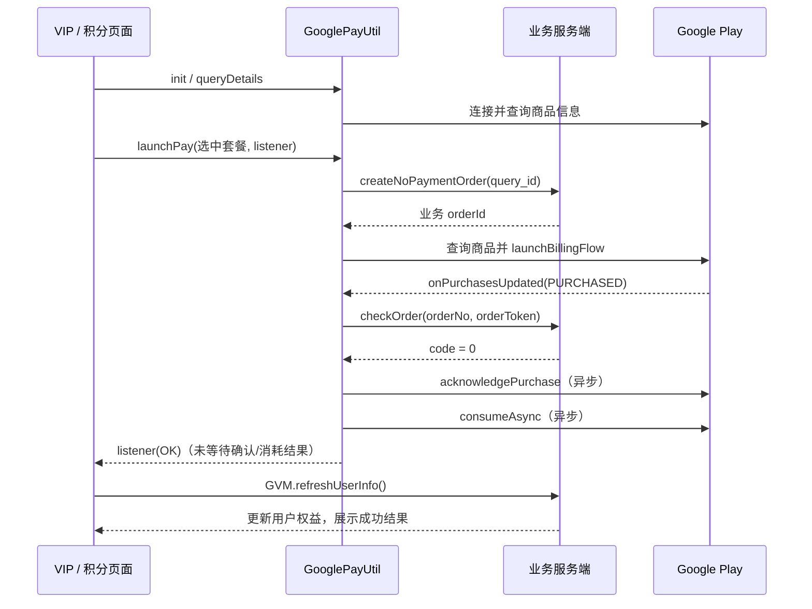

# 代码审查记录

## 2026-09-08 17:43

### 检查范围与结论

检查 `a` 模块的 17 个 `dialog*.xml`、关联按钮与背景资源，以及举报按钮的选择状态逻辑。本次为静态样式检查，未修改应用代码，也未触发举报、支付或删除操作。

结论：旧弹窗仍有主题色和按钮规格需要统一；举报按钮存在可操作状态与视觉状态不一致的问题。新退出登录与删除 Faces 弹窗已采用当前设计样式，应保留各自的背景和操作层级。

### 发现的问题

1. **[P2] 10 个弹窗仍使用旧荧光绿主按钮。**
   `a/src/main/res/drawable/a_btn_jb_r100.xml:3` 使用 100dp 圆角，颜色为 `#BCFF08`。当前主按钮资源 `a_bg_primary_gradient_pill.xml` 使用 16dp 圆角及 `#09EDBE → #08DDF2` 渐变。广告、VIP 广告、通用内容、体验、失败提示、提示、工具、通知及换脸说明等弹窗仍引用旧资源，造成新旧主题并存。另外，`dialog_aadsshow.xml:168`、`dialog_areport.xml:118` 和 `dialog_aswaphint.xml:35` 仍有硬编码绿色文字或描边。

   建议：将需要主题主按钮的弹窗切换到统一公共样式，并处理相应强调色。旧按钮资源还被 16 个非弹窗布局使用，修改共享资源前需确认这些页面的影响范围。

2. **[P2] 举报按钮选择原因后仍显示灰色。**
   `a/src/main/res/layout/dialog_areport.xml:139` 将 Report 的文字颜色固定为 `#5E5E5E`；`a/src/main/java/com/a/dialog/AReportDialog.kt:53` 更新了 `selectedNum`，但按钮未绑定该状态。选择原因后提交逻辑可以执行，界面却仍呈现类似不可用的灰色，同时 Cancel 使用更醒目的旧绿色。

   建议：根据是否选中原因更新 Report 的可用状态和颜色，并统一取消操作的视觉层级。当前未选原因时已有提示逻辑，本问题不是已确认的提交失败。

3. **[P3] 旧弹窗的按钮尺寸、圆角与次按钮填充缺少统一规格。**
   例如 `dialog_amian_tool.xml:128` 和 `dialog_acustom.xml:58` 使用 42dp 高度，`dialog_acontent.xml:57` 使用 44dp；新公共 `ASettingsDialogButton` 使用至少 48dp 高度、16sp 加粗文字和 16dp 圆角。旧次按钮还混用 `#1AFFFFFF`、`#0DFFFFFF` 透明填充及不同圆角，显示颜色会随弹窗背景变化。

   建议：按主按钮、次按钮和文字操作分别建立公共规格；保留第三方登录、底部弹层等特殊类型的设计要求。

### 弹窗清单

| 布局 | 当前按钮样式与检查结果 |
| --- | --- |
| `dialog_aadsshow.xml` | 旧绿色主按钮，Skip 文字也有旧绿色 |
| `dialog_aadsvipshow.xml` | 旧绿色主按钮 |
| `dialog_acontent.xml` | 旧绿色主按钮，44dp 按钮高度 |
| `dialog_aexperience.xml` | 旧绿色主按钮，文字规格与新按钮不同 |
| `dialog_afily.xml` | 旧绿色主按钮，44dp 按钮高度 |
| `dialog_ahint.xml` | 旧绿色主按钮 |
| `dialog_ahinta.xml` | 旧绿色主按钮 |
| `dialog_amian_tool.xml` | 旧绿色主按钮，42dp 按钮高度 |
| `dialog_anotice.xml` | 旧绿色主按钮 |
| `dialog_aswaphint.xml` | 旧绿色主按钮与示例图片描边；全屏说明类型 |
| `dialog_acustom.xml` | 42dp 按钮；底部弹层类型 |
| `dialog_aexit.xml` | 44dp 按钮；底部弹层类型 |
| `dialog_areport.xml` | Cancel 为旧绿色，Report 固定灰色且未绑定选择状态 |
| `dialog_alogin.xml` | Google 白色登录按钮，应按第三方登录设计保留 |
| `dialog_alogout.xml` | 新样式：深灰按钮、红色退出文字、白色取消文字 |
| `dialog_a_remove_face.xml` | 新样式：渐变主按钮、深灰取消按钮 |
| `dialog_y.xml` | 主按钮已使用新渐变公共样式；次操作为文字按钮 |

### 背景差异与验证

旧通用居中弹窗使用 `a_bg_dialog.xml`（`#2D313A`、32dp 圆角）；底部弹层使用 `a_bg_dialog2.xml`（`#2A2A2A`、顶部 24dp 圆角）。新退出登录弹窗为 `#2E3139`、24dp 圆角，删除 Faces 弹窗为 `#222222`、24dp 圆角。后两者有对应设计参考，背景不同本身不作为缺陷；统一时应按弹窗类型及设计图处理。

17 个弹窗 XML 均解析通过。以上结论来自布局、资源引用和关联 Kotlin 静态检查；未逐个运行截图核对，本次未重新构建或安装。

---

## 2026-09-10 11:52

### GooglePayUtil 支付逻辑与流程审查

审查对象为当前工作区的 [GooglePayUtil.kt](D:/ASWorkspace/YN/Alviora/Alviora/module/face/src/main/java/com/face/util/GooglePayUtil.kt:37)，并追踪 a 模块 VIP 页面、公共积分购买页面、Repository、GVM 与请求回调封装。本次分析现有实现，未修改支付代码。

#### 输入与验证范围

- 当前声明的 Google Play Billing / billing-ktx 版本均为 9.1.0。
- 已读取完整支付工具、实际调用入口、订单接口、错误回调类型及 Activity 协程作用域；目标 Kotlin 文件当前无 Git 差异。
- 本次为静态流程审查，未重新构建、运行支付测试或发起下单/验单请求。现有 face 测试目录中未检索到此支付工具的专项测试，a 模块没有对应测试目录。
- 已核对 Google 官方 Billing 集成说明和 API 参考。服务端验单、发货、幂等、通知处理与 Play Console 商品配置不在本地证据范围内。

#### 正常支付流程

1. **初始化与价格**：AMainActivity 初始化时调用 `init()`；AVipActivity 的 `onResume()` 也调用它。客户端启用一次性商品的 pending 支持和服务自动重连。AVipViewModel 从 `ARepository.getVipScheme()` 取得套餐，再通过 `queryDetails()` 获取 Google 本地化价格。
2. **点击购买**：[launchPay](D:/ASWorkspace/YN/Alviora/Alviora/module/face/src/main/java/com/face/util/GooglePayUtil.kt:75) 保存套餐到单例字段，重置重试次数、记录点击事件、显示 Loading，然后提交套餐 ID 创建未付款业务订单。
3. **拉起收银台**：[innerLaunchBilling](D:/ASWorkspace/YN/Alviora/Alviora/module/face/src/main/java/com/face/util/GooglePayUtil.kt:166) 将 `subscription == 0` 映射为 `INAPP`，其他值映射为 `SUBS`。查询 SKU 后，订阅固定取第一个 offerToken。`obfuscatedAccountId` 使用“用户 ID 或 not_login | 是否存在试用文案”；`obfuscatedProfileId` 保存业务 orderId。
4. **购买回调与验单**：[onPurchasesUpdated](D:/ASWorkspace/YN/Alviora/Alviora/module/face/src/main/java/com/face/util/GooglePayUtil.kt:371) 收到 `OK + PURCHASED` 后进入 `checkUpdate()`。目前只处理尚未 acknowledged 的购买，从 profileId 取业务订单号，将 purchaseToken 发给服务端。这里的 orderId 是业务订单号，不是 Google 的 GPA 订单号。
5. **成功判定**：请求框架以响应 `code == 0` 进入 `onSuccess`，支付工具不使用 `checkOrder` 返回的 data 字符串；随后异步确认、异步消耗、记录成功事件并立即通知页面。
6. **刷新权益**：[AVipActivity](D:/ASWorkspace/YN/Alviora/Alviora/a/src/main/java/com/a/activity/AVipActivity.kt:181) 收到 OK 后关闭 Loading、提示成功，再调用 `GVM.refreshUserInfo()`；刷新成功才打开 AVipSuccessActivity。积分页面同样刷新用户信息，并根据余额变化展示结果。用户刷新失败显示 `Auto refresh failed`。工具本身不直接修改 VIP/余额。

#### 当前实际接口

支付工具仍引用 `com.face.net.Repository`，因此 a 页面通过它支付时仍使用旧网关；ARepository 同名接口目前没有被这条调用链采用。

| 动作 | GooglePayUtil 实际请求路径 | 传参 |
| --- | --- | --- |
| 创建业务订单 | `POST /alviora?a=pay&m=createNoPaymentOrder` | 表单 `query_id = scheme.id.toString()` |
| 服务端验单 | `POST /alviora?a=pay&m=googlePayCallback` | 表单 `orderNo = obfuscatedProfileId`、`orderToken = purchaseToken` |

域名为 `https://www.vantasyx.com`。定义见 [Api.kt](D:/ASWorkspace/YN/Alviora/Alviora/module/face/src/main/java/com/face/net/Api.kt:888) 和 [DiffKey.kt](D:/ASWorkspace/YN/Alviora/Alviora/key/src/main/java/com/key/DiffKey.kt:14)。AApi 中对应直接路径为 `/pay/createNoPaymentOrder`、`/pay/googlePayCallback`。

另外，[GVM.refreshUserInfo](D:/ASWorkspace/YN/Alviora/Alviora/module/face/src/main/java/com/face/util/GVM.kt:220) 也仍使用公共 Repository，因此支付后的权益刷新走旧 `/alviora?a=login&m=getUserInfo`。这说明迁移边界尚未覆盖共享工具；仅凭客户端不能判定旧网关是否失效。若继续迁移，宜给共享支付工具注入订单服务，避免 face 模块反向依赖 a 模块。

#### 异常与补单流程

| 场景 | 当前行为 |
| --- | --- |
| 创建订单失败或 data 为空 | `payFail`，通知调用方、清空当前状态、关闭 Loading |
| Google 连接失败 / 查不到商品 | `payFail`；部分错误使用统一提示和默认 -1 |
| 用户取消支付 | 上报 cancel，返回 USER_CANCELED，清空状态并关闭 Loading |
| Google 返回 PENDING | 普通购买回调忽略该状态，没有等待付款提示或 Loading 收尾 |
| 验单失败 | 最多额外重试两次；当前判断的是错误码是否非空，不是网络异常 |
| 首次连接成功 | 分别查询 INAPP、SUBS 的当前持有购买，逐笔调用 `checkUpdate`；并非获取所有历史交易 |
| 已 acknowledged / profileId 缺失 | `checkUpdate` 直接跳过，不验单、不回调 |
| 补单成功且没有当前 listener | 不主动刷新 GVM，权益展示依赖其他页面的后续刷新 |

#### 🔴 严重问题

**1. [P1] 所有商品同时确认和消耗，且没有处理消耗失败。**

- 位置：[GooglePayUtil.kt:258](D:/ASWorkspace/YN/Alviora/Alviora/module/face/src/main/java/com/face/util/GooglePayUtil.kt:258)、[消耗回调:280](D:/ASWorkspace/YN/Alviora/Alviora/module/face/src/main/java/com/face/util/GooglePayUtil.kt:280)、[入口过滤:238](D:/ASWorkspace/YN/Alviora/Alviora/module/face/src/main/java/com/face/util/GooglePayUtil.kt:238)。
- 证据：验单成功后不区分商品类型，同时启动 acknowledge 和 consume；consume 的 BillingResult 被 `_` 丢弃，随后即通知成功。
- 影响：订阅也会被送入消耗请求；对于可消耗商品，如果 acknowledge 成功但 consume 失败，之后查询出的购买会因 `isAcknowledged == true` 被跳过，客户端没有补消耗路径，重复购买可能受阻。若 INAPP 中包含非消耗型永久权益，无条件消耗也会清除 Google 侧持有记录；是否存在这种配置需核对商品配置。
- 建议：区分可消耗商品、非消耗商品及订阅；可消耗商品执行 consume，其他按需 acknowledge，分别处理结果并持久化待完成操作。Google 的消耗接口本身满足确认要求，订阅应使用确认接口。参见 [BillingClient 官方 API](https://developer.android.com/reference/com/android/billingclient/api/BillingClient#consumeAsync(com.android.billingclient.api.ConsumeParams,com.android.billingclient.api.ConsumeResponseListener))。

**2. [P1] 历史补单可以误触发当前订单的成功/失败回调。**

- 位置：[GooglePayUtil.kt:267](D:/ASWorkspace/YN/Alviora/Alviora/module/face/src/main/java/com/face/util/GooglePayUtil.kt:267)、[当前回调:284](D:/ASWorkspace/YN/Alviora/Alviora/module/face/src/main/java/com/face/util/GooglePayUtil.kt:284)。
- 证据：`queryPurchase` 和实时购买都进入 `checkUpdate`，但回调、埋点及清理使用全局 `launchData/schemeBean`，未与正在验证的 orderId/token 比较。
- 触发：旧订单 A 补单验单期间用户发起新订单 B；A 返回成功时直接调用 B 的 listener 并清空 B 的状态，页面可能跳转 B 的成功页；A 失败同样可能中止 B 的状态。
- 建议：按 purchaseToken/业务订单号隔离任务，进行中去重；只向匹配的订单发送支付结果，补单使用独立的权益刷新事件。

#### 🟡 建议修改

**3. [P2] PENDING 在两条回调路径中的处理不一致。**

- 位置：[实时回调:376](D:/ASWorkspace/YN/Alviora/Alviora/module/face/src/main/java/com/face/util/GooglePayUtil.kt:376)、[查询回调:363](D:/ASWorkspace/YN/Alviora/Alviora/module/face/src/main/java/com/face/util/GooglePayUtil.kt:363)。
- 实时回调只处理 PURCHASED，PENDING 分支没有关闭 Loading 或通知等待付款；查询回调却把所有购买送去验单，没有状态过滤。服务端是否拒绝未付款订单未验证，不能据此断言会错误发货。
- 建议：统一入口按状态分支；PENDING 收起 Loading 并展示等待状态，PURCHASED 才继续已付款处理。Google 要求仅在 PURCHASED 后授予权益及确认购买，参见 [pending 处理说明](https://developer.android.com/google/play/billing/integrate#pending)。

**4. [P2] 补单查询只成功一次，缺少恢复时机和独立权益刷新。**

- 位置：[GooglePayUtil.kt:343](D:/ASWorkspace/YN/Alviora/Alviora/module/face/src/main/java/com/face/util/GooglePayUtil.kt:343)、[查询状态:365](D:/ASWorkspace/YN/Alviora/Alviora/module/face/src/main/java/com/face/util/GooglePayUtil.kt:365)。
- 任一商品类型查询 OK 都将唯一的 `autoQueryPurchaseAfterConnect` 设为 false；另一类型失败不会重试。之后 init 只检查连接，已连接时不查询，重连时也不会再自动补单。验单又依附当前 Activity 的 lifecycleScope，页面销毁后没有持久任务兜底。
- 影响：同一进程内错过回调、网络恢复或页面退出后，待处理交易可能一直等不到再次处理；纯补单成功也没有主动刷新用户信息。
- 建议：连接成功及回前台时恢复查询，分别处理两类查询结果；用独立作用域/持久任务处理验单并发送权益刷新事件。官方建议通过恢复查询覆盖遗漏回调和待付款转成功场景，参见 [检测购买说明](https://developer.android.com/google/play/billing/integrate#detect)。

**5. [P2] 重试条件误用了错误码，业务拒绝也会连续重试。**

- 位置：[GooglePayUtil.kt:291](D:/ASWorkspace/YN/Alviora/Alviora/module/face/src/main/java/com/face/util/GooglePayUtil.kt:291)、[ResultBuilder.kt:44](D:/ASWorkspace/YN/Alviora/Alviora/module/architecture/src/main/java/com/zzkj/structure/net/ResultBuilder.kt:44)。
- `onFailed = { _, t, _ -> }` 中 t 实际是 errorCode。请求封装的 mCode 是非空 Int，因此 `t != null` 不能筛选网络异常，业务失败也会立即重复请求；计数器还由所有交易共享。
- 建议：按 Throwable/明确的可重试错误码分类，为每笔交易设置独立次数和退避间隔，保留服务端错误信息用于诊断。

**6. [P2] 拉起支付失败时丢失 Google 错误码。**

- 位置：[GooglePayUtil.kt:227](D:/ASWorkspace/YN/Alviora/Alviora/module/face/src/main/java/com/face/util/GooglePayUtil.kt:227)、[AVipActivity.kt:205](D:/ASWorkspace/YN/Alviora/Alviora/a/src/main/java/com/a/activity/AVipActivity.kt:205)。
- `launchBillingFlow` 同步返回非 OK 时，调用 `payFail` 未传 responseCode，页面得到 -1；若 Google 返回 ITEM_ALREADY_OWNED，就无法进入页面已有的 PurchaseErrorDialog 分支。
- 建议：保留原始 responseCode；对已拥有商品触发查询与权益核对。

#### 已核对的边界

- 缺少 profileId 时直接 return，当前没有基于 token 的订单找回入口；是否需要支持应用外购买/旧订单，应结合服务端映射能力确认。
- 商品显示和实际支付目前都固定取第一个订阅 offer；未发现明确的 basePlanId/offerId 选择机制。单 offer 时不能据此认定价格错误，多 offer 上线前需核对展示与购买是否对应。
- `destroy()` 关闭 lazy BillingClient 后无法重建。官方说明已关闭实例不能复用；但当前两处调用紧接 `AppManager.exitApp()`，后者执行 `exitProcess(0)`，所以不把“正常页面销毁后必然无法再付款”列为现有缺陷。若将来改变退出方式，应同步处理重建。参见 [BillingClient 生命周期说明](https://developer.android.com/reference/com/android/billingclient/api/BillingClient)。
- 订阅续费、退款撤销、账号与订单归属校验及验单幂等依赖服务端，客户端代码不足以证明这些机制是否已实现。

#### 亮点与结论

已有服务端验单调用、业务订单标识传递、取消分支清理及 Google 本地化商品查询，正常支付链条明确。

静态审查结论：`Request Changes`。识别到 2 个 P1、4 个 P2；未运行支付场景验证。建议先处理商品确认/消耗与订单状态隔离，再完善 pending、补单和错误传播。后续验证应覆盖订阅、积分重复购买、取消、延迟付款、消费失败、断网恢复和旧单/新单交错回调。

---
