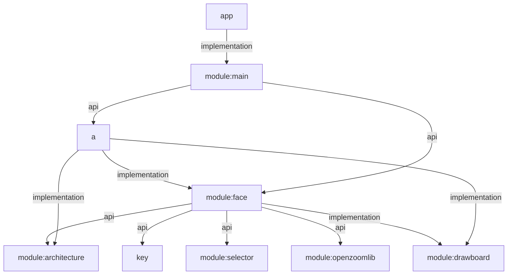
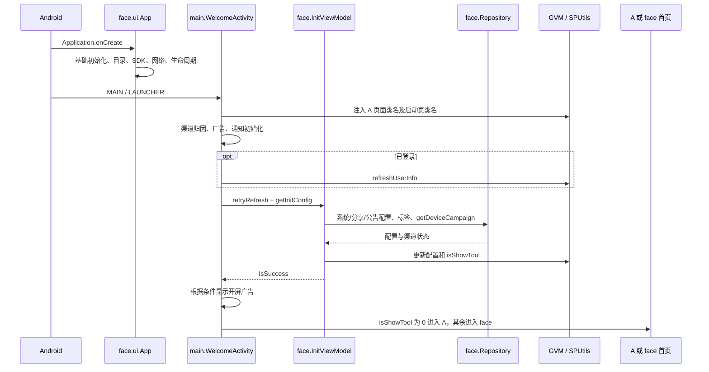
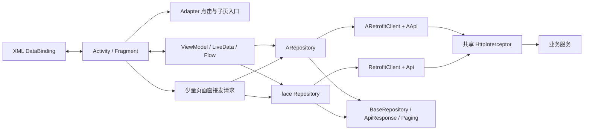
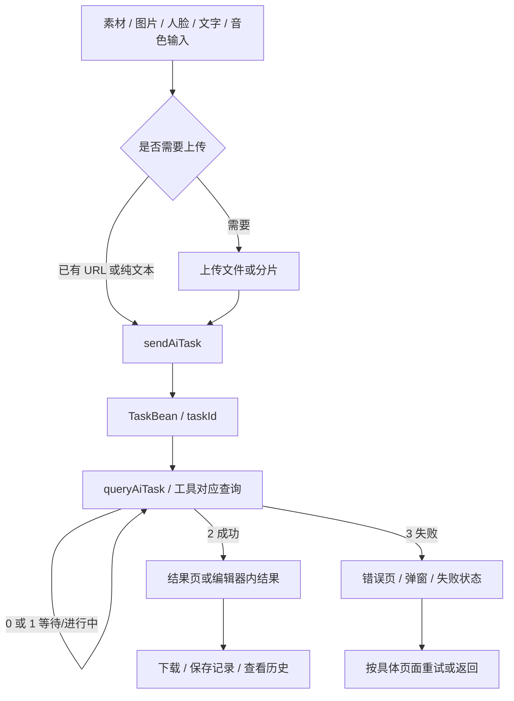
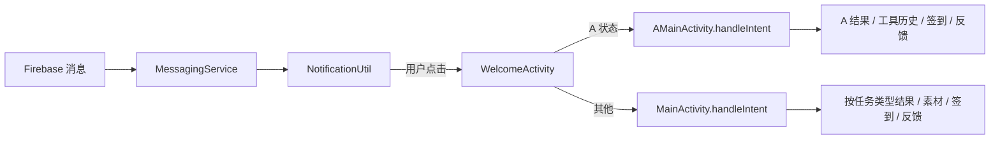

# 项目架构与模块调用流程

整理日期：2026-09-10。范围为当前工作区 `settings.gradle` 声明的全部 9 个 Gradle 模块，说明主要职责、依赖关系、启动、业务与数据流。根据静态源码整理，不代表已逐页运行或验证服务端业务。

阅读入口：[文档目录](D:/ASWorkspace/YN/Alviora/Alviora/docs/README.md)、[a 模块功能](D:/ASWorkspace/YN/Alviora/Alviora/docs/a模块功能与调用流程.md)、[face/ui 模块功能](D:/ASWorkspace/YN/Alviora/Alviora/docs/face-ui模块功能与调用流程.md)。

## 1. 项目由哪些模块组成

整个项目生成一个 Android 应用。`app` 负责应用配置和打包；`module:main` 负责启动与推送；`a` 和 `module:face` 提供两套业务界面。`face` 同时承担共享业务层，基础库提供网络、绑定、选图、预览和绘图支持。

| Gradle 模块 | namespace | 主要职责 | main 源文件数 |
| --- | --- | --- | ---: |
| [app](D:/ASWorkspace/YN/Alviora/Alviora/app) | `com.alviora.generator` | 应用 ID、Application 声明、构建/打包配置、依赖业务入口；当前 main 下没有 Kotlin/Java 业务类。 | 0 |
| [module:main](D:/ASWorkspace/YN/Alviora/Alviora/module/main) | `com.face.main` | `WelcomeActivity` 启动/渠道分流；`MessagingService` 接收 Firebase 消息。 | 2 |
| [a](D:/ASWorkspace/YN/Alviora/Alviora/a) | `com.a` | A 业务页面、五个工具、人脸/换脸/结果/账号/VIP，独立 A 网络入口。 | 124 |
| [module:face](D:/ASWorkspace/YN/Alviora/Alviora/module/face) | `com.face` | 共享完整业务界面、Application、登录/支付/广告/状态、数据实体、网络、视频编辑播放等。 | 494 |
| [module:architecture](D:/ASWorkspace/YN/Alviora/Alviora/module/architecture) | `com.zzkj.structure` | MVVM 基础、DataBinding、协程请求/分页、网络响应、生命周期、语言/偏好设置等。 | 79 |
| [module:selector](D:/ASWorkspace/YN/Alviora/Alviora/module/selector) | `com.luck.picture.lib` | 本地媒体选择、预览、相册扫描、权限、选择结果与文件路径处理。 | 191 |
| [module:openzoomlib](D:/ASWorkspace/YN/Alviora/Alviora/module/openzoomlib) | `com.flyjingfish.openimagelib` | 大图/视频预览、缩放/手势、转场，包含图片加载与播放器接入。 | 127 |
| [module:drawboard](D:/ASWorkspace/YN/Alviora/Alviora/module/drawboard) | `com.king.drawboard` | `DBV` 画板和绘制动作、蒙版输出，用于画笔消除等编辑操作。 | 11 |
| [key](D:/ASWorkspace/YN/Alviora/Alviora/key) | `com.key` | `DiffKey` 渠道/产品配置与 SDK 初始化入口、`SingularListener`；承载应用名、图标、媒体等公共资源。 | 2 |
| 合计 | — | 只统计各模块 `src/main` 下 Kotlin/Java 文件，不含生成代码、测试、XML、构建目录。 | 1030 |

Gradle 模块和功能包是两种层级：例如 face 的 `tvoice`、`paperwork`、`share` 是同一 Gradle 模块内的功能目录，a 的 `activity/tool` 也是包目录。

## 2. Gradle 依赖关系

箭头表示“左侧直接依赖右侧”，根据有效的 `api/implementation project(...)` 声明整理。

`api` 会向依赖方暴露编译依赖，因此 a 能使用 face 对外暴露的实体、选择器、预览库等。`implementation` 表示当前模块内部使用的依赖。这里描述的是构建关系；页面跳转、共享状态、动态类名路由是另一层运行时关系。

没有 `face → a` 的直接 Gradle 依赖。共享代码需要打开 A 页面时，通常通过 `SPUtils` 保存的完整类名构造 Intent；这些类名由同时依赖 a/face 的 `WelcomeActivity` 注入。

依据：[settings.gradle](D:/ASWorkspace/YN/Alviora/Alviora/settings.gradle)、[app/build.gradle](D:/ASWorkspace/YN/Alviora/Alviora/app/build.gradle:95)、[main/build.gradle](D:/ASWorkspace/YN/Alviora/Alviora/module/main/build.gradle:61)、[a/build.gradle](D:/ASWorkspace/YN/Alviora/Alviora/a/build.gradle:52)、[face/build.gradle](D:/ASWorkspace/YN/Alviora/Alviora/module/face/build.gradle:63)。

## 3. 启动流程和 A/B 分流

- Application 由 [app Manifest](D:/ASWorkspace/YN/Alviora/Alviora/app/src/main/AndroidManifest.xml) 指定为 `com.face.ui.App`。它初始化工作目录、Firebase、Facebook、日志、设备标识、网络、Install Referrer、进程生命周期、刷新组件及播放器。
- Launcher 在 [main Manifest](D:/ASWorkspace/YN/Alviora/Alviora/module/main/src/main/AndroidManifest.xml) 的 `WelcomeActivity`。初始化失败时保留失败/重试状态，不直接放行首页。
- Welcome 使用 **face 的 InitViewModel/Repository**，即使最终进入 A 页面，启动请求也不会自动切换成 ARepository。
- A 首页未登录时进入 `ALoginActivity`；Google/游客/账号登录成功后会再次请求渠道并决定首页。
- A 首页恢复或切 Tab 时也会刷新渠道状态；`aIsAB == 1` 时打开共享 MainActivity。因此 A/B 不是仅在安装时确定一次。
- `BaseBindingActivity` 在运行状态丢失且允许重启时，可以通过 `SPUtils.mainAct` 返回启动页恢复配置。

### 动态页面路由

| SPUtils 字段 | Welcome 注入的目标 | 用途 |
| --- | --- | --- |
| `mainAct` | `WelcomeActivity` | 基类配置恢复/重启入口。 |
| `aLoginName` | `ALoginActivity` | 共享代码在 A 状态下的登录路由。 |
| `aMainName` | `AMainActivity` | 启动、登录成功、结果回首页等 A 首页目标。 |
| `aVipName` | `AVipActivity` | 共享 `VipActivity.jump` 在 A 状态下的充值入口。 |
| `aCompletionName` | `ACompletionActivity` | 共享生成流程在 A 状态下的结果目标。 |

定位：[WelcomeActivity](D:/ASWorkspace/YN/Alviora/Alviora/module/main/src/main/java/com/face/main/WelcomeActivity.kt)、[InitViewModel](D:/ASWorkspace/YN/Alviora/Alviora/module/face/src/main/java/com/face/viewmodel/InitViewModel.kt)、[BaseBindingActivity](D:/ASWorkspace/YN/Alviora/Alviora/module/face/src/main/java/com/face/ui/BaseBindingActivity.kt)、[VipActivity](D:/ASWorkspace/YN/Alviora/Alviora/module/face/src/main/java/com/face/ui/VipActivity.kt)。

## 4. 业务功能地图

| 功能域 | a | face |
| --- | --- | --- |
| 首页 | Explore、Picture、Me | Explore、Template、Tool、ShareZone、Me |
| 素材 | Banner、分类、图片分页、搜索、收藏、浏览历史 | 图片/视频分类、专题详情、发现列表、搜索、收藏与推荐 |
| 换脸 | 图片素材进入 ASwap；可分配单/多个人脸 | SwapFaceNew/SwapFaceList，图片/视频/自定义素材、多种预览与生成分支 |
| 人脸 | Faces 网格、上传检测、拍照、删除 | 人脸分类汇总、分类列表、上传检测、拍照、排序/删除 |
| 工具 | 消除、证件照、卡通化、背景移除、年龄变化 | 以上相关功能及老照片修复、动图、文生图、拥抱、接吻、换装、动作视频、动态玩法、音色/配音 |
| 自定义与分享 | 通过 A 提示入口进入 face 的自定义素材流程 | 照片/视频上传、裁剪/抽帧/选脸、素材保存、分享区与我的分享 |
| 个人与商业化 | A 账号/设置/VIP/结果；签到、反馈等使用共享页面 | 账号、VIP、积分购买、签到、邀请、反馈、积分兑换等 |
| 生成结果/记录 | A 换脸结果、工具结果、Works、独立历史页 | 换脸/四图/工具/配音结果、失败状态、不同工具历史 |

这里只表示主要入口分工，不表示两套界面的每个分支一一对应。A 视频素材、owner 作品等待、自定义素材、签到/反馈、支付等都涉及共享模块。

完整页面关系与参数见 [a 功能文档](D:/ASWorkspace/YN/Alviora/Alviora/docs/a模块功能与调用流程.md) 和 [face/ui 功能文档](D:/ASWorkspace/YN/Alviora/Alviora/docs/face-ui模块功能与调用流程.md)。

## 5. UI、ViewModel 与网络如何配合

典型流程为点击事件 → ViewModel 加载/校验 → Repository 请求或分页 → LiveData/Flow → XML 绑定刷新。项目并没有强制所有业务都放 ViewModel：账号、举报、删除、扣算力等部分请求直接写在 Activity/弹窗内，导航也可能写在 Adapter 中。

### 两套接口地址

| 层 | a | face |
| --- | --- | --- |
| Repository | `com.a.net.ARepository` | `com.face.net.Repository` |
| Retrofit | `ARetrofitClient` | `RetrofitClient` |
| 接口声明 | `AApi` | `Api` |
| 基地址 | AApi 内的 `https://www.vantasyx.com/` | `Api.BASE_URL` 取 `DiffKey.API_URL` |
| 路径风格 | `/ai/`、`/user/`、`/pay/`、`/login/`、`/api/`、`/statistics/`、`/grok/`、`/aitask/` 和根路径 | `alviora?a=ai&m=`、`alviora?a=user&m=` 等网关前缀，具体声明以 Api 为准 |
| 共享部分 | face 实体、HttpInterceptor、architecture 请求基础 | 同左 |

`HttpInterceptor` 添加 token、应用/设备等公共请求信息；Repository 基类统一处理接口响应、异常和分页。具体方法的 POST/Form/Field/Query/Body 等编码由接口注解决定，不能仅凭方法名或所属页面推断。

**a 已迁移直接 Repository 调用，不等于整个运行流程只发直接路径请求**：共享 InitViewModel、GVM、GooglePayUtil、FirebaseMessageUtil 和被复用的 face 页面仍可能调用旧 Repository。定位请求时需要沿调用类追踪到底。

定位：[AApi](D:/ASWorkspace/YN/Alviora/Alviora/a/src/main/java/com/a/net/AApi.kt)、[ARepository](D:/ASWorkspace/YN/Alviora/Alviora/a/src/main/java/com/a/net/ARepository.kt)、[Api](D:/ASWorkspace/YN/Alviora/Alviora/module/face/src/main/java/com/face/net/Api.kt)、[HttpInterceptor](D:/ASWorkspace/YN/Alviora/Alviora/module/face/src/main/java/com/face/net/HttpInterceptor.kt)、[BaseRepository](D:/ASWorkspace/YN/Alviora/Alviora/module/architecture/src/main/java/com/zzkj/structure/net/BaseRepository.kt)。

## 6. 共享状态和本地存储

| 组件 | 保存内容 / 功能 | 与业务的关系 |
| --- | --- | --- |
| `GVM` | 用户、登录/VIP、A/B、网络/前后台、页面刷新等可观察状态 | A/face 共用；`updateUserInfo` 更新页面状态并持久化用户，`refreshUserInfo` 请求服务器。 |
| `SPUtils` | 用户缓存、配置、价格、工具消耗、次数、动态页面类名等 | 继承 `BaseSharedPreferences("AI_FACE")`，由 Kotlin 属性委托读取/写入。 |
| `SPbaseUtils` | 语言、主题、基础缓存标记、loadAB 等 | 同样使用 `AI_FACE`，并非另外一套隔离用户配置。 |
| Room `AppDatabase` | 当前声明 `SearchHistoryBean`，数据库 `db_swapai` | 搜索历史使用 DAO/Flow；换脸作品、收藏、浏览历史和工具记录主要来自服务端接口。 |
| 文件与下载 | `Constants` 路径、`FileUtil`、`DownloadUtil` | 本地媒体、上传中间文件、生成结果下载和公共目录保存。 |

以 `var hugPinot by preference("30")` 为例，未指定 key 时使用属性名 `hugPinot`，默认值为字符串 `"30"`；赋值会通过委托写入 SharedPreferences，读取时有已存值就返回已存值。更改代码中的默认值不会覆盖已保存的值。对象/列表委托使用 Moshi JSON，修改取出的对象字段后通常需要重新赋值才会写回。

本地 `SPUtils` 和运行时 `GVM` 分工不同：直接修改偏好设置不等于自动触发所有页面更新，页面通常通过 GVM LiveData、onResume 或显式刷新接口更新。

定位：[GVM](D:/ASWorkspace/YN/Alviora/Alviora/module/face/src/main/java/com/face/util/GVM.kt)、[SPUtils](D:/ASWorkspace/YN/Alviora/Alviora/module/face/src/main/java/com/face/util/SPUtils.kt)、[SharedPreferencesKtx](D:/ASWorkspace/YN/Alviora/Alviora/module/architecture/src/main/java/com/zzkj/structure/util/ktx/SharedPreferencesKtx.kt)、[SPbaseUtils](D:/ASWorkspace/YN/Alviora/Alviora/module/architecture/src/main/java/com/zzkj/structure/util/SPbaseUtils.kt)、[AppDatabase](D:/ASWorkspace/YN/Alviora/Alviora/module/face/src/main/java/com/face/database/AppDatabase.kt)。

## 7. 生成任务公共链

主要生成任务代码将 0/1 当作未完成、2 当作成功、3 当作失败。具体工具还有页面本地状态，语音分析等也有独立流程；不要把这个概览当成所有状态字段的统一枚举。

`taskId` 用于查询/取消任务，`mediaId` 用于素材，工具生成记录的 `recordId` 用于记录管理。换脸结果通常从 TaskBean 查询，工具结果常以 ToolTaskBean 传递。各页面 Intent 参数存在 `task_id` 和 `taskId` 两种拼写，见对应业务文档参数表。

任务类型集中在 [AiTaskType.java](D:/ASWorkspace/YN/Alviora/Alviora/module/face/src/main/java/com/face/key/AiTaskType.java)。新定位功能时，先查 taskType，再查 `sendAiTask` 调用、查询位置和成功结果页；不能仅凭 Activity 名称判断任务类型。

## 8. 支付、广告、推送和媒体库

### 支付

`GooglePayUtil` 位于 face/util，A 和共享 VIP/积分等页面复用它。首页和 VIP 页获取后端方案后查询对应 Google 商品价格；Billing 连接成功还会查询已有购买。商品详情查询、已有购买查询和实际发起购买是不同阶段。

主要链：页面选择商品 → GooglePayUtil → 后端创建业务订单 → Google Billing 支付 → 后端订单校验 → 页面回调/GVM 刷新权益。详细时机和已知实现边界见 [Google Play 支付流程](D:/ASWorkspace/YN/Alviora/Alviora/docs/GooglePlay支付流程.md)，本文不重复展开。

### 广告与使用额度

共享 [ad 目录](D:/ASWorkspace/YN/Alviora/Alviora/module/face/src/main/java/com/face/ad) 封装广告初始化、加载、显示、回调与销毁；业务页结合 `SPUtils` 的免费次数、每日广告次数、VIP 使用阈值和用户余额决定是否展示广告或充值提示。看完广告后由业务回调继续生成，不是广告模块直接创建所有 AI 任务。

### 推送

`MessagingService.onNewToken` 经 `FirebaseMessageUtil` 保存 token；`handleMsg` 对消息进行业务处理和通知构造。当前 `onMessageReceived` 的前台自建通知业务块已注释，不能只看该函数推断所有消息显示行为。

| msg_type | 消息侧 | A 首页 | face 首页 |
| --- | --- | --- | --- |
| 1 | 刷新用户状态 | 非页面跳转分支 | 非页面跳转分支 |
| 100 | 任务通知 | 查询任务；明确处理 FACESWAP 结果、ID_CARD 工具历史 | 查询任务，再按类型分到换脸/四图/工具/语音结果 |
| 101 | 素材通知 | 当前没有对应分支 | 进入素材换脸页 |
| 201 | 签到通知 | 共享 SigninActivity | SigninActivity |
| 301 | 反馈回复通知 | 共享 FeedbackMsgActivity | FeedbackMsgActivity |

Welcome 转发 `msg_type/task_id/media_id/feedback_id`，并兼容最初 msg_type 为字符串或整数的情况；各首页接收整数。A 与 face 的推送目标集合不同。

定位：[MessagingService](D:/ASWorkspace/YN/Alviora/Alviora/module/main/src/main/java/com/face/main/MessagingService.kt)、[NotificationUtil](D:/ASWorkspace/YN/Alviora/Alviora/module/face/src/main/java/com/face/util/NotificationUtil.kt)、[AMainActivity](D:/ASWorkspace/YN/Alviora/Alviora/a/src/main/java/com/a/activity/AMainActivity.kt)、[MainActivity](D:/ASWorkspace/YN/Alviora/Alviora/module/face/src/main/java/com/face/ui/MainActivity.kt)。

### 媒体基础库

| 库 | 调用方式和职责边界 |
| --- | --- |
| selector | 页面用 `PictureSelector.create(...)` 配置媒体类型/数量，通过 `OnResultCallbackListener` 取得 LocalMedia/本地路径；onCamera 回调可转到业务拍照页。选择器负责取输入，不负责 AI 生成。 |
| openzoomlib | 页面/播放器用 `OpenImage.with(...)` 配置图片/视频列表、样式、点击位置和转场；结果预览、视频组件使用。 |
| drawboard | `DBV` 提供绘制与 maskBitmap，消除页上传原图和蒙版；画板本身不访问 AI 接口。 |
| face/video、videoclips | 播放器封装、缓存、大图视频联动、视频裁剪/帧率/抽帧控件。 |
| face/net/download | 下载流与进度回调。 |
| face/net/update | 分片上传、进度和重试；此处 update 指上传处理，不能仅按目录名理解为应用版本升级。`UpdateUtil.cancelRepository()` 当前为空实现。 |

## 9. face 模块内部层次

| 目录 | 职责 |
| --- | --- |
| `ui`（116 个 Kotlin 文件） | 页面、Fragment、Application 和页面基础类；按功能包细分。已有完整说明和索引。 |
| `viewmodel` | 初始化、Activity/Fragment 的业务状态和请求逻辑。 |
| `adapter` | 素材、收藏、生成历史、工具、分享、人脸等列表和点击分流。 |
| `bean` | 用户、素材、任务、配置、订单、工具结果等共享实体。 |
| `net` | Repository/Api/Retrofit/拦截器及上传下载。 |
| `database` | Room 数据库和搜索历史 DAO。 |
| `util` | GVM、SPUtils、支付/登录、事件、推送、设备、文件、录音等共享工具。 |
| `ad` | 广告生命周期与播放/奖励相关回调。 |
| `view` | 业务弹窗、选择器、输入/波形/分享等自定义组件。 |
| `video`、`videoclips` | 视频播放、缓存、剪辑与抽帧组件。 |
| `key` | 任务类型和运行常量；与 Gradle `:key` 配置/资源模块不是同一目录。 |

详见 [face/ui 功能流程](D:/ASWorkspace/YN/Alviora/Alviora/docs/face-ui模块功能与调用流程.md) 和 [116 文件索引](D:/ASWorkspace/YN/Alviora/Alviora/docs/face-ui页面索引.md)。a 的目录分工及 40 页面索引见对应文档。

## 10. 维护时从哪里开始查

| 需求 / 现象 | 首先查看 | 然后追踪 |
| --- | --- | --- |
| 启动失败、A/B 页面异常 | WelcomeActivity、InitViewModel | getDeviceCampaign、GVM.isShowTool、SP 动态类名、BaseBindingActivity |
| A 页面 UI/按钮状态 | `a/res/layout` 对应布局、页面 Activity/Fragment | A ViewModel、Adapter、dialog；参考 [a 页面索引](D:/ASWorkspace/YN/Alviora/Alviora/docs/a模块页面索引.md) |
| face 某个工具功能 | 对应 ui 功能目录 | ViewModel 的 taskType/请求，再查结果/历史 Adapter |
| 点击列表去了意外页面 | 实际绑定的 Adapter | itemType/mediaType/owner/state 分支，不能只看宿主页面 |
| 接口路径或参数不符 | 当前调用类导入的 Repository | AApi/Api、公共拦截器及请求基础类 |
| 用户信息/VIP 不刷新 | GVM.refreshUserInfo/updateUserInfo | SPUtils 缓存、页面观察者、onResume、支付回调 |
| 图片上传或生成停住 | 上传回调、任务提交、查询状态 | 页面计时器与后端状态是否分离，是否取消或销毁协程 |
| 下载/保存异常 | Completion ViewModel、DownloadUtil | FileUtil、结果 URL、系统存储权限与公共目录保存分支 |
| 语言或本地配置 | ASetting/Setting、SPbaseUtils | LanguageUtil、SharedPreferences 委托、values 资源 |
| 包名/图标/渠道配置 | app 构建与 Manifest、key 资源/配置 | main Manifest 合并结果、DiffKey 的实际引用 |

本文覆盖项目全部 Gradle 模块的主要分工和跨模块流程；页面级覆盖为 a 的 40 个页面和 face/ui 的 116 个文件。媒体基础库按职责和接入点说明，没有把 1030 个源文件逐个展开。所有具体行为以当前源码为准，服务端返回、配置控制的入口和运行时权限仍需实际环境验证。
